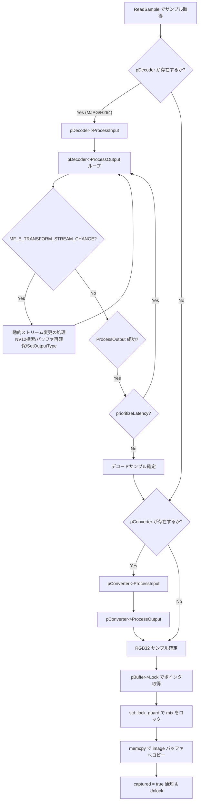

# `CamMf` クラス実装の完全解説

本ドキュメントでは、`mfcapture` プロジェクトにおいて Microsoft Media Foundation を使用してビデオキャプチャを行う `CamMf` クラスの実装について、ソースコード ([CamMf.h](file:///d:/Users/tokoi/Documents/Projects/worktrees/mfcapture/CamMf.h), [CamMf.cpp](file:///d:/Users/tokoi/Documents/Projects/worktrees/mfcapture/CamMf.cpp)) と突き合わせながら詳細に解説します。

また、実装内で利用されている Windows API、Media Foundation API、COM インターフェースの各関数について、引数や戻り値を含めた包括的なリファレンスを掲載しています。

---

## 1. 概要とプロジェクトにおける役割

`CamMf` クラスは、基底クラス [Camera](file:///d:/Users/tokoi/Documents/Projects/worktrees/mfcapture/Camera.h) を継承し、Windows 環境において Microsoft Media Foundation を利用して UVC (USB Video Class) カメラ等からビデオフレームを取得・処理するクラスです。

### 主な役割と設計方針
1. **Media Foundation 固有処理の隠蔽**
   - COM オブジェクト、Source Reader、MFT (Media Foundation Transform) デコーダ/カラーコンバータなどの低レイヤ処理を `CamMf` 内部に閉じ込め、UI や描画パイプラインへ露出させません。
   - UI 用には汎用的な構造体 `CaptureFormat` を提供します。
2. **MFT パイプラインによる柔軟なデコードと色変換**
   - カメラからの出力が MJPG や H.264 の場合は MFT デコーダを用いて NV12 にデコードし、さらに MFT カラーコンバータ (`CLSID_CColorConvertDMO`) を用いて RGB32 (RGBA) 形式へ変換して CPU メモリ上のフレームに書き込みます。
   - NV12 や YUY2 の場合はカラーコンバータのみを通して直接 RGB32 に変換します。
3. **遅延初期化 (Delayed Initialization) と高速フォーマット列挙**
   - デバイスやフォーマットの列挙時 (`enumerateFormats`) には重い MFT デコーダやコンバータの初期化を行わず、キャプチャ開始・選択時 (`select` / `setFormat`) に必要なパイプラインのみを構築します。
4. **低遅延 (Low Latency) 最適化**
   - `MF_LOW_LATENCY` 属性や `CODECAPI_AVLowLatencyMode` を有効化し、カメラキャプチャのディレイを極小化しています。
   - レイテンシ優先モード (`prioritizeLatency == true`) の場合はデコーダのキュー内にある最新フレームまで高速に読み進めて破棄し、常に最新のフレームを提供します。
5. **スレッド安全な排他制御とマルチスレッド設計**
   - バックグラウンドキャプチャスレッド (`capture()`) がフレームを取得し、メイン描画スレッドが `transmit()` 経由で OpenGL PBO (Pixel Buffer Object) または CPU メモリへ安全にデータ転送を行います。

---

## 2. クラス構造とコンポーネント

### 2.1 ネストクラス・構造体

#### `CamMf::VideoFormat` (内部構造体)
カメラデバイスがサポートする解像度、フレームレート、サブタイプ (GUID) を保持する内部構造体です。
```cpp
struct VideoFormat
{
  UINT32 width;     ///< 幅
  UINT32 height;    ///< 高さ
  UINT32 fpsNum;    ///< フレームレートの分子 (Numerator)
  UINT32 fpsDenom;  ///< フレームレートの分母 (Denominator)
  GUID subType;     ///< ピクセルフォーマット/コーデックの GUID (MFVideoFormat_MJPG 等)
};
```

#### `CamMf::ComInitializer` (内部シングルトンクラス)
COM ライブラリと Media Foundation の初期化・終了、および接続されているカメラデバイスの列挙を集中管理するシングルトンクラスです。
- `ComInitializer::getInstance()`: インスタンス取得時に COM (`CoInitializeEx`) と Media Foundation (`MFStartup`) を自動初期化します。
- `ComInitializer::activate()`: 指定されたデバイスインデックスのメディアソース (`IMFMediaSource`) を生成します。
- `ComInitializer::getDeviceList()`: 接続されているビデオデバイスの表示名リストを取得します。
- デストラクタで `MFShutdown()`、`CoUninitialize()`、およびメディアソースアクティベーションオブジェクトの解放を行います。

---

## 3. 主要処理フローとソースコード解説

ソースコードの各メソッドの実装詳細を解説します。

### 3.1 COM と Media Foundation の初期化とデバイス列挙
- **対象ソース**: [CamMf.cpp:L87-L176](file:///d:/Users/tokoi/Documents/Projects/worktrees/mfcapture/CamMf.cpp#L87-L176) (`ComInitializer::initialize`)

```cpp
const char* CamMf::ComInitializer::initialize()
```
1. `CoInitializeEx(nullptr, COINIT_MULTITHREADED)` を呼び出し、マルチスレッド COM モデルで初期化します。
2. `MFStartup(MF_VERSION, MFSTARTUP_FULL)` で Media Foundation を起動します。
3. `MFCreateAttributes` で属性ストアを作成し、`MF_DEVSOURCE_ATTRIBUTE_SOURCE_TYPE` に `MF_DEVSOURCE_ATTRIBUTE_SOURCE_TYPE_VIDCAP_GUID` を設定してビデオキャプチャデバイスを検索条件とします。
4. `MFEnumDeviceSources` で該当するデバイスのアクティベーションオブジェクト配列 (`ppSourceActivate`) を列挙します。
5. 各アクティベーションオブジェクトから `MF_DEVSOURCE_ATTRIBUTE_FRIENDLY_NAME` を取得し、`表示名##インデックス` の形式で `deviceList` に追加します。

---

### 3.2 フォーマットの列挙 (`enumerateFormats`)
- **対象ソース**: [CamMf.cpp:L220-L287](file:///d:/Users/tokoi/Documents/Projects/worktrees/mfcapture/CamMf.cpp#L220-L287) (`CamMf::enumerateFormats`)

```cpp
bool CamMf::enumerateFormats()
```
1. `pSourceReader->GetNativeMediaType(MF_SOURCE_READER_FIRST_VIDEO_STREAM, dwMediaTypeIndex, &pMediaType)` をループ呼び出しして、カメラがネイティブでサポートするメディアタイプを列挙します。
2. メジャータイプが `MFMediaType_Video` であることを確認し、サブタイプ (フォーマット GUID: MJPG, NV12, YUY2, H264 等) を取得します。
3. `MFGetAttributeSize` で解像度 (幅・高さ)、`MFGetAttributeRatio` でフレームレート (分子・分母) を取得します。
4. サポート対象のコーデックであり、FPS が 5.0 以上であるものを選択肢として抽出し、`availableFormats` (内部用) および `formatList` (UI 表示用 `CaptureFormat` 構造体) に追加します。
5. この段階では MFT デコーダやコンバータのインスタンス化を行わず、軽量な検索・列挙に留めます。

---

### 3.3 MFT パイプラインの探索と接続

#### `findVideoDecoder` (デコーダ探索)
- **対象ソース**: [CamMf.cpp:L292-L348](file:///d:/Users/tokoi/Documents/Projects/worktrees/mfcapture/CamMf.cpp#L292-L348)

```cpp
HRESULT CamMf::findVideoDecoder(
  const GUID& subtype,
  IMFTransform** ppDecoder,
  BOOL bAllowAsync,
  BOOL bAllowHardware,
  BOOL bAllowTranscode
) const
```
MJPG や H.264 などの圧縮形式をデコードするため、`MFTEnumEx` を呼び出して `MFT_CATEGORY_VIDEO_DECODER` カテゴリから入力形式 `subtype`、出力形式 `MFVideoFormat_NV12` に対応する MFT デコーダを検索します。検索された最初のアクティベーションオブジェクトから `ActivateObject` で `IMFTransform` インターフェースを生成します。

#### Low Latency モードの設定
- **対象ソース**: [CamMf.cpp:L548-L583](file:///d:/Users/tokoi/Documents/Projects/worktrees/mfcapture/CamMf.cpp#L548-L583) (`setFormat` 内)

デコーダが生成されると、`pDecoder->QueryInterface(IID_PPV_ARGS(&pCodecAPI))` で `ICodecAPI` インターフェースを取得し、`CODECAPI_AVLowLatencyMode` を有効化 (`VT_UI4` の `1` または `VT_BOOL` の `VARIANT_TRUE`) します。これによりデコーダ内部のフレームバッファリングによる遅延を抑えます。

#### `setUpPipeline` (MFT の入力・出力タイプ設定)
- **対象ソース**: [CamMf.cpp:L353-L401](file:///d:/Users/tokoi/Documents/Projects/worktrees/mfcapture/CamMf.cpp#L353-L401)

```cpp
HRESULT CamMf::setUpPipeline(IMFTransform* pTransform, const VideoFormat& format, const GUID& subType) const
```
1. `MFCreateMediaType` で入力用メディアタイプを作成し、`MF_MT_MAJOR_TYPE` (Video)、`MF_MT_SUBTYPE` (入力 GUID)、解像度、フレームレートを設定して `pTransform->SetInputType(0, pInputType, 0)` を実行します。
2. 同様に出力用メディアタイプを作成し、`subType` (例: NV12 または RGB32) を指定して `pTransform->SetOutputType(0, pOutputType, 0)` を実行します。
3. `ProcessMessage` で MFT に対し `MFT_MESSAGE_COMMAND_FLUSH`、`MFT_MESSAGE_NOTIFY_START_OF_STREAM`、`MFT_MESSAGE_NOTIFY_BEGIN_STREAMING` を送信してストリーミング状態へ移行させます。

---

### 3.4 出力バッファの構築 (`createDecoderBuffer`, `createConverterBuffer`)
- **対象ソース**: [CamMf.cpp:L424-L474](file:///d:/Users/tokoi/Documents/Projects/worktrees/mfcapture/CamMf.cpp#L424-L474)

MFT の出力データを受け取るため、アラインメントが適用されたメモリバッファ (`IMFMediaBuffer`) を確保します。
- `createDecoderBuffer()`: NV12 の場合、幅・高さを 16 の倍数に切り上げたサイズから理論計算値 `(alignedWidth * alignedHeight * 3) / 2` を算出し、`pDecoder->GetOutputStreamInfo()` で取得した MFT 要求サイズと比較して大きい方を確保します。
- `createConverterBuffer()`: `MFCalculateImageSize(MFVideoFormat_RGB32, width, height, &cbConverterCalc)` で RGB32 のバッファ長を計算し、アラインメントに合わせた `MFCreateAlignedMemoryBuffer` で `pConverterBuffer` を生成します。

---

### 3.5 フォーマット設定 (`setFormat`)
- **対象ソース**: [CamMf.cpp:L479-L623](file:///d:/Users/tokoi/Documents/Projects/worktrees/mfcapture/CamMf.cpp#L479-L623)

ユーザーがフォーマットを選択した際、以下の処理を行います：
1. 既存の `pDecoder` と `pConverter` を `cleanUpTransform` で破棄します。
2. `SourceReader->SetCurrentMediaType` でカメラの出力フォーマットを設定します。
3. サブタイプに応じたデコード/変換ルートを決定します：
   - **MJPG / H264**: MFT デコーダ (`findVideoDecoder`) で NV12 へデコードし、続いてカラーコンバータ (`CLSID_CColorConvertDMO`) で RGB32 へ変換します。
   - **NV12 / YUY2**: デコーダは不要で、カラーコンバータのみを通し RGB32 へ変換します。
4. 基底クラスの内部フレームバッファ `frame` および `image` を `width * height * 4` (RGB32 相当) にリサイズします。

---

### 3.6 キャプチャおよび処理ループ (`capture`)
- **対象ソース**: [CamMf.cpp:L695-L1152](file:///d:/Users/tokoi/Documents/Projects/worktrees/mfcapture/CamMf.cpp#L695-L1152)

キャプチャスレッド (`thr`) 上で `running == true` の間ループ実行されます。



#### 1. サンプルの読み出し
`pSourceReader->ReadSample(MF_SOURCE_READER_FIRST_VIDEO_STREAM, 0, ...)` により、カメラから `IMFSample` を取得します。

#### 2. デコーダ処理 (`pDecoder`)
- `pDecoder->ProcessInput(0, pSample, 0)` で圧縮フレームを投入します。
- `pDecoder->ProcessOutput` を呼び出してデコード済みフレームを取得します。
- **動的ストリーム変更 (`MF_E_TRANSFORM_STREAM_CHANGE`) への対応**:
  デコーダが入力解像度や内部ストリーム変更を検知すると `MF_E_TRANSFORM_STREAM_CHANGE` が返されます。
  1. `GetOutputAvailableType` で NV12 フォーマットを探索・選択します。
  2. 入力メディアタイプからフレームサイズや FPS 属性をコピーし、`pDecoder->SetOutputType` を呼び出します。
  3. `createDecoderBuffer()` でバッファを再作成し、`pConverter` のパイプラインも更新・再構築します。
  4. ループを `continue` して `ProcessOutput` をやり直します。
- **レイテンシ優先モードの処理**:
  `prioritizeLatency == true` の場合、`ProcessOutput` ループを継続してキュー内に溜まっている過去フレームをスキップし、最新のデコードサンプル `pLatestDecodedSample` のみを採用します。

#### 3. カラーコンバータ処理 (`pConverter`)
- NV12 / YUY2 またはデコード後の NV12 サンプルを `pConverter->ProcessInput(0, pSample, 0)` に投入します。
- `MFCreateSample` と `pConverterBuffer` を準備し、`pConverter->ProcessOutput` で RGB32 (RGBA) へ変換します。

#### 4. メモリ転送とスレッド同期
- 得られたサンプルのバッファから `pBuffer->Lock(&pData, nullptr, &cbDataLength)` で CPU ポインタを取得します。
- 全フレーム処理モード (`prioritizeLatency == false`) の場合は、前回のフレーム描画/転送が完了するまで `std::this_thread::yield()` で待機します。
- `std::lock_guard<std::mutex> lock{ mtx }` でミューテックスをロックし、`memcpy(image.data(), pData, cbDataLength)` で `image` バッファへフレームデータをコピーします。
- `captured = true` を設定して描画スレッドへ通知し、`pBuffer->Unlock()` でロックを解除します。

---

### 3.7 クローズとリソース解放 (`stop`, `close`, `cleanUpTransform`)
- **対象ソース**: [CamMf.cpp:L406-L419](file:///d:/Users/tokoi/Documents/Projects/worktrees/mfcapture/CamMf.cpp#L406-L419) (`cleanUpTransform`), [L1157-L1208](file:///d:/Users/tokoi/Documents/Projects/worktrees/mfcapture/CamMf.cpp#L1157-L1208) (`stop`, `close`)

1. **`stop()`**:
   - `running = false` を設定します。
   - `pSourceReader->Flush(MF_SOURCE_READER_FIRST_VIDEO_STREAM)` を呼び出し、ブロッキング中の `ReadSample` を解除します。
   - `thr.join()` でキャプチャスレッドを安全に合流・停止させます。
2. **`cleanUpTransform()`**:
   - MFT に対し `MFT_MESSAGE_NOTIFY_END_STREAMING` および `MFT_MESSAGE_NOTIFY_END_OF_STREAM` を送信した後に `Release()` を呼び出します。
3. **`close()`**:
   - `cleanUpTransform` でデコーダ・コンバータを解放します。
   - `SafeRelease` で `pDecoderBuffer`, `pConverterBuffer`, `pSourceReader`, `pMediaSource` を解放します。
   - 基底クラス `Camera::close()` を呼び出します。

---

## 4. 使用関数・API リファレンス

`CamMf` クラスの実装で参照されているすべての Windows API、Media Foundation API、および COM メソッドのリファレンスです。

---

### 4.1 COM 初期化・基礎 API

#### `CoInitializeEx`
- **ヘッダー**: `<objbase.h>` / **ライブラリ**: `ole32.lib`
- **概要**: 呼び出し元スレッドの COM ライブラリを初期化し、スレッドモデルを設定します。
- **引数**:
  - `pvReserved` (`LPVOID`, IN): 予約済み。必ず `nullptr` を指定します。
  - `dwCoInit` (`DWORD`, IN): スレッドのコンカレンシーモデル。`COINIT_MULTITHREADED` (マルチスレッドアパートメント) 等を指定。
- **戻り値** (`HRESULT`): `S_OK` (成功)、`S_FALSE` (既に初期化済み)、エラーコード。
- **CamMf での用途**: [CamMf.cpp:L96](file:///d:/Users/tokoi/Documents/Projects/worktrees/mfcapture/CamMf.cpp#L96) にて、Media Foundation を使用するマルチスレッド環境を準備するために呼び出します。

#### `CoUninitialize`
- **ヘッダー**: `<objbase.h>` / **ライブラリ**: `ole32.lib`
- **概要**: 現在のスレッドの COM ライブラリをクローズし、リソースを解放します。
- **引数**: なし
- **戻り値**: なし
- **CamMf での用途**: [CamMf.cpp:L81](file:///d:/Users/tokoi/Documents/Projects/worktrees/mfcapture/CamMf.cpp#L81) (`ComInitializer` デストラクタ) にて、COM ライブラリの終了処理を行います。

#### `CoTaskMemFree`
- **ヘッダー**: `<combaseapi.h>` / **ライブラリ**: `ole32.lib`
- **概要**: COM タスクメモリ アロケータによって割り当てられたメモリブロックを解放します。
- **引数**:
  - `pv` (`LPVOID`, IN): 解放するメモリブロックへのポインタ。
- **戻り値**: なし
- **CamMf での用途**: [CamMf.cpp:L70](file:///d:/Users/tokoi/Documents/Projects/worktrees/mfcapture/CamMf.cpp#L70), [L166](file:///d:/Users/tokoi/Documents/Projects/worktrees/mfcapture/CamMf.cpp#L166), [L344](file:///d:/Users/tokoi/Documents/Projects/worktrees/mfcapture/CamMf.cpp#L344) 等で、MFEnumDeviceSources や MFTEnumEx が確保したポインタ配列および文字列メモリを解放します。

#### `CoCreateInstance`
- **ヘッダー**: `<combaseapi.h>` / **ライブラリ**: `ole32.lib`
- **概要**: 指定された CLSID に関連付けられたクラスの単一のオブジェクトを作成します。
- **引数**:
  - `rclsid` (`REFCLSID`, IN): オブジェクトの作成に使用されるデータとコードに関連付けられた CLSID。
  - `pUnkOuter` (`LPUNKNOWN`, IN): 集約オブジェクトの一部として作成する場合はアグリゲータへのポインタ。それ以外は `nullptr`。
  - `dwClsContext` (`DWORD`, IN): 実行可能コードを実行するコンテキスト (`CLSCTX_INPROC_SERVER` 等)。
  - `riid` (`REFIID`, IN): オブジェクトと通信するために使用されるインターフェースの識別子への参照。
  - `ppv` (`LPVOID*`, OUT): `riid` で要求されたインターフェースポインタを受け取る変数へのアドレス。
- **戻り値** (`HRESULT`): `S_OK` (成功)、`REGDB_E_CLASSNOTREG` (未登録) 等。
- **CamMf での用途**: [CamMf.cpp:L598](file:///d:/Users/tokoi/Documents/Projects/worktrees/mfcapture/CamMf.cpp#L598) にて、カラーコンバータ MFT オブジェクト (`CLSID_CColorConvertDMO`) を直接生成するために使用します。

---

### 4.2 Media Foundation 基盤 API

#### `MFStartup`
- **ヘッダー**: `<mfapi.h>` / **ライブラリ**: `MFplat.lib`
- **概要**: Microsoft Media Foundation プラットフォームを初期化します。
- **引数**:
  - `Version` (`ULONG`, IN): バージョン番号。通常は `MF_VERSION` を指定。
  - `dwFlags` (`DWORD`, IN): 初期化フラグ。`MFSTARTUP_FULL` (全機能初期化) または `MFSTARTUP_LITE`。
- **戻り値** (`HRESULT`): `S_OK` (成功) 等。
- **CamMf での用途**: [CamMf.cpp:L107](file:///d:/Users/tokoi/Documents/Projects/worktrees/mfcapture/CamMf.cpp#L107) にて、Media Foundation プラットフォームの初期化を行います。

#### `MFShutdown`
- **ヘッダー**: `<mfapi.h>` / **ライブラリ**: `MFplat.lib`
- **概要**: Media Foundation プラットフォームをシャットダウンし、リソースを解放します。
- **引数**: なし
- **戻り値** (`HRESULT`): `S_OK` (成功) 等。
- **CamMf での用途**: [CamMf.cpp:L78](file:///d:/Users/tokoi/Documents/Projects/worktrees/mfcapture/CamMf.cpp#L78) にて終了時に呼び出します。

#### `MFCreateAttributes`
- **ヘッダー**: `<mfapi.h>` / **ライブラリ**: `MFplat.lib`
- **概要**: 空の属性ストア (`IMFAttributes`) を作成します。
- **引数**:
  - `ppMFAttributes` (`IMFAttributes**`, OUT): 作成された `IMFAttributes` インターフェースポインタを受け取ります。
  - `cInitialSize` (`UINT32`, IN): 属性ストアの初期割り当て容量。
- **戻り値** (`HRESULT`): `S_OK` (成功) 等。
- **CamMf での用途**: [CamMf.cpp:L118](file:///d:/Users/tokoi/Documents/Projects/worktrees/mfcapture/CamMf.cpp#L118), [L638](file:///d:/Users/tokoi/Documents/Projects/worktrees/mfcapture/CamMf.cpp#L638) にてデバイス検索用および Source Reader 用の属性設定ストアを作成します。

#### `MFEnumDeviceSources`
- **ヘッダー**: `<mfidl.h>` / **ライブラリ**: `MF.lib`
- **概要**: 指定された属性の条件に合致するハードウェアデバイス (カメラ等) を列挙します。
- **引数**:
  - `pAttributes` (`IMFAttributes*`, IN): 検索条件が格納された属性ストアへのポインタ。
  - `pppSourceActivate` (`IMFActivate***`, OUT): 作成された `IMFActivate` ポインタの配列を受け取るポインタのアドレス。`CoTaskMemFree` で解放が必要。
  - `pcSourceActivate` (`UINT32*`, OUT): 配列内の要素数を受け取る変数へのポインタ。
- **戻り値** (`HRESULT`): `S_OK` (成功) 等。
- **CamMf での用途**: [CamMf.cpp:L136](file:///d:/Users/tokoi/Documents/Projects/worktrees/mfcapture/CamMf.cpp#L136) にてシステムに接続されたビデオキャプチャデバイスを列挙します。

#### `MFCreateMediaType`
- **ヘッダー**: `<mfapi.h>` / **ライブラリ**: `MFplat.lib`
- **概要**: 空のメディアタイプオブジェクト (`IMFMediaType`) を作成します。
- **引数**:
  - `ppMFType` (`IMFMediaType**`, OUT): 作成された `IMFMediaType` ポインタを受け取ります。
- **戻り値** (`HRESULT`): `S_OK` (成功) 等。
- **CamMf での用途**: [CamMf.cpp:L367](file:///d:/Users/tokoi/Documents/Projects/worktrees/mfcapture/CamMf.cpp#L367), [L503](file:///d:/Users/tokoi/Documents/Projects/worktrees/mfcapture/CamMf.cpp#L503) 等で MFT や Source Reader のメディアタイプ設定オブジェクトを生成します。

#### `MFGetAttributeSize` / `MFSetAttributeSize`
- **ヘッダー**: `<mfapi.h>` / **ライブラリ**: `MFplat.lib`
- **概要**: 属性ストアから幅・高さなどのサイズペア (64ビットPacked値) を取得/設定するヘルパー関数です。
- **引数**:
  - `pAttributes` (`IMFAttributes*`, IN/OUT): 属性ストアのポインタ。
  - `guidKey` (`REFGUID`, IN): 取得/設定対象の GUID (`MF_MT_FRAME_SIZE` 等)。
  - `punWidth` (`UINT32*` または `UINT32`, IN/OUT): 幅。
  - `punHeight` (`UINT32*` または `UINT32`, IN/OUT): 高さ。
- **戻り値** (`HRESULT`): `S_OK` (成功) 等。
- **CamMf での用途**: 解像度 (`MF_MT_FRAME_SIZE`) の取得・設定に使用します。

#### `MFGetAttributeRatio` / `MFSetAttributeRatio`
- **ヘッダー**: `<mfapi.h>` / **ライブラリ**: `MFplat.lib`
- **概要**: 属性ストアから分子・分母の比率ペアを取得/設定するヘルパー関数です。
- **引数**:
  - `pAttributes` (`IMFAttributes*`, IN/OUT): 属性ストアのポインタ。
  - `guidKey` (`REFGUID`, IN): 取得/設定対象の GUID (`MF_MT_FRAME_RATE`, `MF_MT_PIXEL_ASPECT_RATIO` 等)。
  - `punNumerator` (`UINT32*` または `UINT32`, IN/OUT): 分子。
  - `punDenominator` (`UINT32*` または `UINT32`, IN/OUT): 分母。
- **戻り値** (`HRESULT`): `S_OK` (成功) 等。
- **CamMf での用途**: フレームレートやアスペクト比の取得・設定に使用します。

#### `MFCreateAlignedMemoryBuffer`
- **ヘッダー**: `<mfapi.h>` / **ライブラリ**: `MFplat.lib`
- **概要**: 指定されたアラインメント要件を満たすシステムメモリバッファ (`IMFMediaBuffer`) を作成します。
- **引数**:
  - `cbMaxBufferSize` (`DWORD`, IN): バッファのサイズ (バイト単位)。
  - `fAlignmentFlags` (`DWORD`, IN): メモリアラインメントマスク (例: 63 = 64バイトアラインメント)。
  - `ppBuffer` (`IMFMediaBuffer**`, OUT): 作成されたバッファオブジェクトを受け取るポインタ。
- **戻り値** (`HRESULT`): `S_OK` (成功) 等。
- **CamMf での用途**: [CamMf.cpp:L448](file:///d:/Users/tokoi/Documents/Projects/worktrees/mfcapture/CamMf.cpp#L448), [L474](file:///d:/Users/tokoi/Documents/Projects/worktrees/mfcapture/CamMf.cpp#L474) にて MFT デコーダおよびカラーコンバータの高速書き込み用出力バッファを生成します。

#### `MFCalculateImageSize`
- **ヘッダー**: `<mfapi.h>` / **ライブラリ**: `MFplat.lib`
- **概要**: 非圧縮ビデオフォーマットと解像度から必要なイメージバッファサイズ (バイト数) を計算します。
- **引数**:
  - `guidSubtype` (`REFGUID`, IN): ピクセルフォーマット GUID (`MFVideoFormat_RGB32` 等)。
  - `unWidth` (`UINT32`, IN): 幅。
  - `unHeight` (`UINT32`, IN): 高さ。
  - `pcbImageSize` (`UINT32*`, OUT): 計算されたイメージサイズを受け取る変数へのポインタ。
- **戻り値** (`HRESULT`): `S_OK` (成功) 等。
- **CamMf での用途**: [CamMf.cpp:L461](file:///d:/Users/tokoi/Documents/Projects/worktrees/mfcapture/CamMf.cpp#L461) にて RGB32 変換後のバッファサイズ計算に使用します。

#### `MFCreateSample`
- **ヘッダー**: `<mfapi.h>` / **ライブラリ**: `MFplat.lib`
- **概要**: 空のメディアサンプルオブジェクト (`IMFSample`) を作成します。
- **引数**:
  - `ppIMFSample` (`IMFSample**`, OUT): 作成されたサンプルオブジェクトを受け取るポインタ。
- **戻り値** (`HRESULT`): `S_OK` (成功) 等。
- **CamMf での用途**: [CamMf.cpp:L788](file:///d:/Users/tokoi/Documents/Projects/worktrees/mfcapture/CamMf.cpp#L788), [L1069](file:///d:/Users/tokoi/Documents/Projects/worktrees/mfcapture/CamMf.cpp#L1069) で MFT デコーダ/コンバータの出力コンテナサンプルを作成します。

---

### 4.3 Source Reader API

#### `MFCreateSourceReaderFromMediaSource`
- **ヘッダー**: `<mfreadwrite.h>` / **ライブラリ**: `MFreadwrite.lib`
- **概要**: メディアソース (`IMFMediaSource`) から Source Reader (`IMFSourceReader`) オブジェクトを作成します。
- **引数**:
  - `pMediaSource` (`IMFMediaSource*`, IN): ソースデータのメディアソースへのポインタ。
  - `pAttributes` (`IMFAttributes*`, IN): オプションの属性ストアポインタ (低遅延やハードウェア転送の制御に使用)。
  - `ppSourceReader` (`IMFSourceReader**`, OUT): 作成された Source Reader ポインタ。
- **戻り値** (`HRESULT`): `S_OK` (成功) 等。
- **CamMf での用途**: [CamMf.cpp:L653](file:///d:/Users/tokoi/Documents/Projects/worktrees/mfcapture/CamMf.cpp#L653) にてカメラからのフレーム読み出し用リーダーを生成します。

#### `IMFSourceReader::GetNativeMediaType`
- **概要**: メディアソースのストリームからネイティブでサポートされているメディアタイプを取得します。
- **引数**:
  - `dwStreamIndex` (`DWORD`, IN): ストリームインデックス (`MF_SOURCE_READER_FIRST_VIDEO_STREAM` 等)。
  - `dwMediaTypeIndex` (`DWORD`, IN): メディアタイプのインデックス (0 から始まる順序)。
  - `ppMediaType` (`IMFMediaType**`, OUT): メディアタイプポインタを受け取るアドレス。
- **戻り値** (`HRESULT`): `S_OK` (成功)、`MF_E_NO_MORE_TYPES` (インデックス範囲外) 等。
- **CamMf での用途**: [CamMf.cpp:L232](file:///d:/Users/tokoi/Documents/Projects/worktrees/mfcapture/CamMf.cpp#L232) にてフォーマット列挙を行います。

#### `IMFSourceReader::SetCurrentMediaType`
- **概要**: 指定したストリームの出力メディアタイプを設定します。
- **引数**:
  - `dwStreamIndex` (`DWORD`, IN): ストリームインデックス。
  - `pdwReserved` (`DWORD*`, IN): 予約済み。`nullptr` を指定。
  - `pMediaType` (`IMFMediaType*`, IN): 設定するメディアタイプへのポインタ。
- **戻り値** (`HRESULT`): `S_OK` (成功) 等。
- **CamMf での用途**: [CamMf.cpp:L523](file:///d:/Users/tokoi/Documents/Projects/worktrees/mfcapture/CamMf.cpp#L523) にて選択されたビデオフォーマットを Source Reader に適用します。

#### `IMFSourceReader::ReadSample`
- **概要**: メディアソースから次のサンプルを読み出します。
- **引数**:
  - `dwStreamIndex` (`DWORD`, IN): 対象のストリームインデックス。
  - `dwControlFlags` (`DWORD`, IN): 読み出し制御フラグ (`0` または `MF_SOURCE_READER_CONTROL_FLAG_DRAIN`)。
  - `pdwActualStreamIndex` (`DWORD*`, OUT): サンプルを取得した実際のストリームインデックス。
  - `pdwStreamFlags` (`DWORD*`, OUT): ストリームの状態フラグ (`MF_SOURCE_READERF_ENDOFSTREAM` 等)。
  - `pllTimestamp` (`LONGLONG*`, OUT): サンプルのタイムスタンプ (100ナノ秒単位)。
  - `ppSample` (`IMFSample**`, OUT): 読み出されたサンプルを受け取るポインタ。
- **戻り値** (`HRESULT`): `S_OK` (成功) 等。
- **CamMf での用途**: [CamMf.cpp:L705](file:///d:/Users/tokoi/Documents/Projects/worktrees/mfcapture/CamMf.cpp#L705) にてカメラフレームを同期取得します。

#### `IMFSourceReader::Flush`
- **概要**: 指定されたストリームの非同期処理やブロッキングされている ReadSample をフラッシュして中断します。
- **引数**:
  - `dwStreamIndex` (`DWORD`, IN): 対象のストリームインデックス。
- **戻り値** (`HRESULT`): `S_OK` (成功) 等。
- **CamMf での用途**: [CamMf.cpp:1168](file:///d:/Users/tokoi/Documents/Projects/worktrees/mfcapture/CamMf.cpp#L1168) にてキャプチャスレッド停止時に `ReadSample` のブロックを解除するために呼び出します。

---

### 4.4 MFT (Media Foundation Transform) API

#### `MFTEnumEx`
- **ヘッダー**: `<mfapi.h>` / **ライブラリ**: `MFplat.lib`
- **概要**: 条件を満たす MFT (Media Foundation Transform) の一覧を列挙します。
- **引数**:
  - `guidCategory` (`GUID`, IN): MFT のカテゴリ (`MFT_CATEGORY_VIDEO_DECODER` 等)。
  - `Flags` (`UINT32`, IN): 検索オプションフラグ (`MFT_ENUM_FLAG_SYNCMFT`, `MFT_ENUM_FLAG_HARDWARE` 等)。
  - `pInputType` (`const MFT_REGISTER_TYPE_INFO*`, IN): 入力形式の条件。
  - `pOutputType` (`const MFT_REGISTER_TYPE_INFO*`, IN): 出力形式の条件。
  - `pppMFT` (`IMFActivate***`, OUT): 該当した `IMFActivate` 配列ポインタを受け取るアドレス。`CoTaskMemFree` で解放が必要。
  - `pnumMFT` (`UINT32*`, OUT): 検出された個数を受け取る変数ポインタ。
- **戻り値** (`HRESULT`): `S_OK` (成功) 等。
- **CamMf での用途**: [CamMf.cpp:L330](file:///d:/Users/tokoi/Documents/Projects/worktrees/mfcapture/CamMf.cpp#L330) にて入力圧縮形式 (MJPG/H264) を NV12 に変換するデコーダを検索します。

#### `IMFTransform::SetInputType` / `IMFTransform::SetOutputType`
- **概要**: MFT の指定された入力/出力ストリームのメディアタイプを設定します。
- **引数**:
  - `dwInputStreamID` / `dwOutputStreamID` (`DWORD`, IN): ストリーム ID (通常 `0`)。
  - `pType` (`IMFMediaType*`, IN): 設定するメディアタイプ。
  - `dwFlags` (`DWORD`, IN): 設定フラグ (通常 `0` または `MFT_SET_TYPE_TEST_ONLY`)。
- **戻り値** (`HRESULT`): `S_OK` (成功) 等。
- **CamMf での用途**: [CamMf.cpp:L374](file:///d:/Users/tokoi/Documents/Projects/worktrees/mfcapture/CamMf.cpp#L374), [L385](file:///d:/Users/tokoi/Documents/Projects/worktrees/mfcapture/CamMf.cpp#L385) にてデコーダ・コンバータの入出力形式を決定します。

#### `IMFTransform::GetOutputStreamInfo`
- **概要**: MFT 出力ストリームのバッファ要件 (必要サイズ `cbSize` やアラインメント `cbAlignment` 等) を取得します。
- **引数**:
  - `dwOutputStreamID` (`DWORD`, IN): 出力ストリーム ID。
  - `pStreamInfo` (`MFT_OUTPUT_STREAM_INFO*`, OUT): ストリーム要件を受け取る構造体ポインタ。
- **戻り値** (`HRESULT`): `S_OK` (成功) 等。
- **CamMf での用途**: [CamMf.cpp:L428](file:///d:/Users/tokoi/Documents/Projects/worktrees/mfcapture/CamMf.cpp#L428), [L457](file:///d:/Users/tokoi/Documents/Projects/worktrees/mfcapture/CamMf.cpp#L457), [L767](file:///d:/Users/tokoi/Documents/Projects/worktrees/mfcapture/CamMf.cpp#L767) にてバッファサイズ算出および MFT 自前サンプル割り当てフラグ (`MFT_OUTPUT_STREAM_PROVIDES_SAMPLES`) の判定に使用します。

#### `IMFTransform::ProcessMessage`
- **概要**: MFT に制御メッセージ (ストリームの開始、終了、フラッシュ等) を送信します。
- **引数**:
  - `eMessage` (`MFT_MESSAGE_TYPE`, IN): 送信するメッセージ (`MFT_MESSAGE_COMMAND_FLUSH`, `MFT_MESSAGE_NOTIFY_BEGIN_STREAMING` 等)。
  - `ulParam` (`ULONG_PTR`, IN): メッセージ固有パラメータ。
- **戻り値** (`HRESULT`): `S_OK` (成功) 等。
- **CamMf での用途**: [CamMf.cpp:L389-L391](file:///d:/Users/tokoi/Documents/Projects/worktrees/mfcapture/CamMf.cpp#L389-L391), [L412-L413](file:///d:/Users/tokoi/Documents/Projects/worktrees/mfcapture/CamMf.cpp#L412-L413) にて MFT の状態遷移を制御します。

#### `IMFTransform::ProcessInput`
- **概要**: MFT の入力ストリームにサンプルを投入して処理を開始させます。
- **引数**:
  - `dwInputStreamID` (`DWORD`, IN): 入力ストリーム ID (通常 `0`)。
  - `pSample` (`IMFSample*`, IN): 処理対象のサンプル。
  - `dwFlags` (`DWORD`, IN): 予約済み。`0` を指定。
- **戻り値** (`HRESULT`): `S_OK` (成功)、`MF_E_NOTACCEPTING` (処理中で入力を受け付けない) 等。
- **CamMf での用途**: [CamMf.cpp:727](file:///d:/Users/tokoi/Documents/Projects/worktrees/mfcapture/CamMf.cpp#L727), [L1066](file:///d:/Users/tokoi/Documents/Projects/worktrees/mfcapture/CamMf.cpp#L1066) にてデコーダ・コンバータへ入力サンプルを投入します。

#### `IMFTransform::ProcessOutput`
- **概要**: MFT から処理結果の出力サンプルを取り出します。
- **引数**:
  - `dwFlags` (`DWORD`, IN): 処理フラグ (通常 `0`)。
  - `cOutputBufferCount` (`DWORD`, IN): 出力バッファ構造体配列の要素数。
  - `pOutputSamples` (`MFT_OUTPUT_DATA_BUFFER*`, IN/OUT): 出力バッファ構造体の配列。
  - `pdwStatus` (`DWORD*`, OUT): 状態値を受け取るポインタ。
- **戻り値** (`HRESULT`): `S_OK` (成功)、`MF_E_TRANSFORM_NEED_MORE_INPUT` (さらなる入力が必要)、`MF_E_TRANSFORM_STREAM_CHANGE` (出力フォーマット変更検出) 等。
- **CamMf での用途**: [CamMf.cpp:L815](file:///d:/Users/tokoi/Documents/Projects/worktrees/mfcapture/CamMf.cpp#L815), [L1084](file:///d:/Users/tokoi/Documents/Projects/worktrees/mfcapture/CamMf.cpp#L1084) にてデコード・変換結果を受け取ります。

---

### 4.5 COM インターフェース メソッド

#### `IMFActivate::ActivateObject`
- **概要**: アクティベーションオブジェクトから実際の COM オブジェクト (メディアソースや MFT) をインスタンス化します。
- **引数**:
  - `riid` (`REFIID`, IN): 要求するインターフェース ID (`IID_IMFMediaSource`, `IID_IMFTransform` 等)。
  - `ppv` (`void**`, OUT): 生成されたインターフェースポインタを受け取るアドレス。
- **戻り値** (`HRESULT`): `S_OK` (成功) 等。
- **CamMf での用途**: [CamMf.cpp:L204](file:///d:/Users/tokoi/Documents/Projects/worktrees/mfcapture/CamMf.cpp#L204), [L338](file:///d:/Users/tokoi/Documents/Projects/worktrees/mfcapture/CamMf.cpp#L338) にてメディアソースやデコーダを実体化します。

#### `IMFAttributes::GetAllocatedString`
- **概要**: 属性ストアから文字列を取得し、CoTaskMemAlloc で割り当てられたワイド文字列ポインタとして返します。
- **引数**:
  - `guidKey` (`REFGUID`, IN): 取得対象の属性 GUID。
  - `ppwszValue` (`LPWSTR*`, OUT): 割り当てられた文字列を受け取るポインタ。`CoTaskMemFree` で解放が必要。
  - `pcchLength` (`UINT32*`, OUT): 文字数 (ヌル文字含まず) を受け取るポインタ。
- **戻り値** (`HRESULT`): `S_OK` (成功) 等。
- **CamMf での用途**: [CamMf.cpp:L154](file:///d:/Users/tokoi/Documents/Projects/worktrees/mfcapture/CamMf.cpp#L154) にてカメラデバイスの表示名 (`MF_DEVSOURCE_ATTRIBUTE_FRIENDLY_NAME`) を取得します。

#### `ICodecAPI::SetValue`
- **概要**: エンコーダ/デコーダのコーデックプロパティを設定します。
- **引数**:
  - `pApi` (`const GUID*`, IN): 設定するプロパティの GUID (`CODECAPI_AVLowLatencyMode` 等)。
  - `Value` (`VARIANT*`, IN): 値を格納した `VARIANT` 構造体へのポインタ。
- **戻り値** (`HRESULT`): `S_OK` (成功) 等。
- **CamMf での用途**: [CamMf.cpp:L563](file:///d:/Users/tokoi/Documents/Projects/worktrees/mfcapture/CamMf.cpp#L563), [L575](file:///d:/Users/tokoi/Documents/Projects/worktrees/mfcapture/CamMf.cpp#L575) にて MFT デコーダを Low Latency モードに設定します。

#### `IMFMediaBuffer::Lock` / `Unlock`
- **概要**: メモリバッファをロックして直接アクセス可能な CPU アドレスを取得 / ロック解除します。
- **引数 (`Lock`)**:
  - `ppBuffer` (`BYTE**`, OUT): バッファの先頭ポインタを受け取る変数ポインタ。
  - `pcbMaxLen` (`DWORD*`, OUT): バッファの最大容量を受け取る変数ポインタ (省略時 `nullptr`)。
  - `pcbCurrentLen` (`DWORD*`, OUT): 有効データ長を受け取る変数ポインタ (省略時 `nullptr`)。
- **戻り値** (`HRESULT`): `S_OK` (成功) 等。
- **CamMf での用途**: [CamMf.cpp:L1108](file:///d:/Users/tokoi/Documents/Projects/worktrees/mfcapture/CamMf.cpp#L1108), [L1132](file:///d:/Users/tokoi/Documents/Projects/worktrees/mfcapture/CamMf.cpp#L1132) にてフレームの生のピクセルデータにアクセスし、`memcpy` でコピーするために使用します。

#### `IMFMediaBuffer::SetCurrentLength` / `GetCurrentLength`
- **概要**: バッファ内に格納されている有効データの長さ (バイト数) を設定 / 取得します。
- **引数 (`SetCurrentLength`)**:
  - `cbLength` (`DWORD`, IN): 設定する有効データ長。
- **戻り値** (`HRESULT`): `S_OK` (成功) 等。
- **CamMf での用途**: [CamMf.cpp:L804](file:///d:/Users/tokoi/Documents/Projects/worktrees/mfcapture/CamMf.cpp#L804), [L1075](file:///d:/Users/tokoi/Documents/Projects/worktrees/mfcapture/CamMf.cpp#L1075) にて MFT 出力バッファの有効長を 0 にリセットして再書き込みを可能にします。

#### `IMFSample::AddBuffer`
- **概要**: メディアサンプルにメディアバッファを追加します。
- **引数**:
  - `pBuffer` (`IMFMediaBuffer*`, IN): 追加するバッファポインタ。
- **戻り値** (`HRESULT`): `S_OK` (成功) 等。
- **CamMf での用途**: [CamMf.cpp:L806](file:///d:/Users/tokoi/Documents/Projects/worktrees/mfcapture/CamMf.cpp#L806), [L1077](file:///d:/Users/tokoi/Documents/Projects/worktrees/mfcapture/CamMf.cpp#L1077) で `pDecoderBuffer` や `pConverterBuffer` を出力用 `IMFSample` にアタッチします。

---

## 5. まとめ

`CamMf` クラスは、Windows 標準の低レイヤマルチメディア API である Microsoft Media Foundation の高度な機能を完全にカプセル化しています。
- **遅延初期化**による軽量な列挙処理
- **Low Latency モード**と最新サンプル優先選択による超低遅延化
- **MFT デコーダ／コンバータのパイプライン動的再構築**による堅牢なストリーム変更追従
- **COM リソース管理の安全な非同期マルチスレッド設計**

これにより、画像処理アプリケーションの描画ループや UI に対し、安定した高品質なビデオフレームを低遅延で提供しています。
