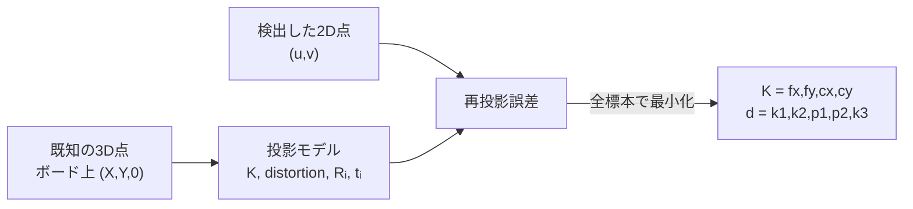
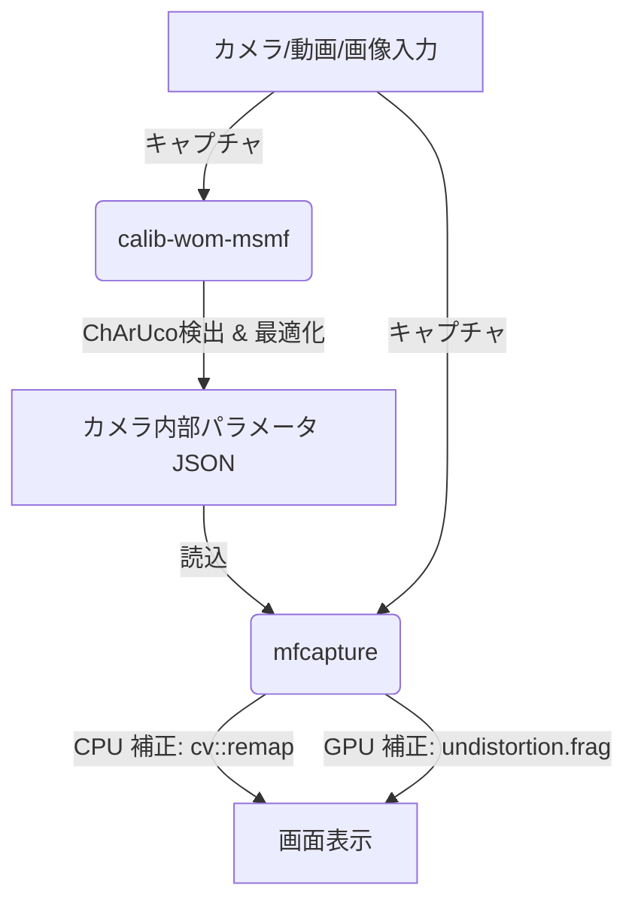
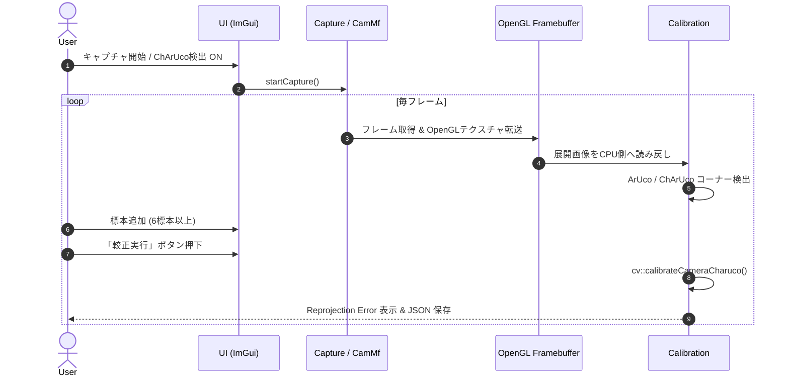
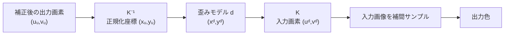

# 実践カメラキャリブレーション & レンズ歪み補正

## ChArUco Board と OpenGL/GLSL によるリアルタイム画像補正技術

---

## 1. アジェンダ

1. **イントロダクション・目的**
2. **カメラモデリングの基礎原理**（ピンホールカメラモデルとカメラ行列）
3. **レンズ歪みの数理モデル**（放射歪み・接線歪み）
4. **ChArUco Board によるキャリブレーション原理**
5. **全体システムアーキテクチャ** (`calib-wom-msmf` & `mfcapture`)
6. **Windows Media Foundation (MSMF) による低遅延キャプチャ**
7. **歪み補正処理の比較**（OpenCV CPU 補正 vs GLSL GPU 補正）
8. **ビルド環境と開発規約** (VS2022 / C++17 / CMake / BOM規約)
9. **ハンズオン実習の流れ**
10. **まとめ & Q&A**

---

## 2. カメラモデリングの基礎原理

### ピンホールカメラモデル (Pinhole Camera Model)

3次元世界座標系 $(X_w, Y_w, Z_w)$ から2次元画像座標系 $(u, v)$ への遠近投影変換。

$$
s \begin{bmatrix} u \\ v \\ 1 \end{bmatrix} = K \begin{bmatrix} R & t \end{bmatrix} \begin{bmatrix} X_w \\ Y_w \\ Z_w \\ 1 \end{bmatrix}
$$

### カメラ内部パラメータ行列 (Camera Matrix) $K$

$$
K = \begin{bmatrix} f_x & 0 & c_x \\ 0 & f_y & c_y \\ 0 & 0 & 1 \end{bmatrix}
$$

- $f_x, f_y$: 画素単位の焦点距離 (Focal Length)
- $c_x, c_y$: 主点 (Principal Point: 光軸と画像平面の交点座標)

---

## 3. レンズ歪みの数理モデル

広角レンズや魚眼レンズでは、光線が歪曲するため直線が曲線として撮影されます。

```text
       [ 補正前 (歪みあり) ]             [ 補正後 (理想的) ]
         +---------------+                 +---------------+
         |  /----+----\  |                 |  |---------|  |
         | |     |     | |                 |  |         |  |
         | |-----+-----| |       ===>      |  |---------|  |
         | |     |     | |                 |  |         |  |
         |  \----+----/  |                 |  |---------|  |
         +---------------+                 +---------------+
```

### 補正計算式（正規化画像座標 $(x, y) = (X/Z, Y/Z)$ に適用）

1. 距離 $r = \sqrt{x^2 + y^2}$
2. **放射歪み (Radial Distortion)**: レンズ形状に起因する樽型・糸巻き型歪み
   $$x_{\text{distorted}} = x (1 + k_1 r^2 + k_2 r^4 + k_3 r^6)$$
   $$y_{\text{distorted}} = y (1 + k_1 r^2 + k_2 r^4 + k_3 r^6)$$
3. **接線歪み (Tangential Distortion)**: レンズとセンサーの平行度ズレ
   $$\delta x = 2 p_1 x y + p_2 (r^2 + 2 x^2)$$
   $$\delta y = p_1 (r^2 + 2 y^2) + 2 p_2 x y$$
4. 最終歪み座標: $x' = x_{\text{distorted}} + \delta x$, $y' = y_{\text{distorted}} + \delta y$
5. 画素座標への変換: $u = f_x x' + c_x$, $v = f_y y' + c_y$

---

## 4. ChArUco Board によるキャリブレーション

### なぜ ChArUco なのか？

| 方式 | 特長 | 課題 |
| :--- | :--- | :--- |
| **チェスボード** | サブピクセル精度のコーナー検出が可能 | 一部でも隠れると全体が検出不能 |
| **ArUco マーカー** | 個別マーカー識別が可能、オクルージョンに強い | コーナー位置の検出精度がやや低い |
| **ChArUco Board** | **両者のハイブリッド**。マーカーで個々の交点を一意特定し、チェスボード交点で超高精度検出 | マーカー検出とボード構成の処理コスト |

```text
+---+---+---+---+
|M1 |   |M2 |   |  ChArUco Board:
+---+---+---+---+  ArUcoマーカー(M1, M2...)でチェスボードの
|   |M3 |   |M4 |  各交点を一意に特定！
+---+---+---+---+  ボードの一部が欠けていても正確にキャリブレーション可能。
```

---

## 4.1 キャリブレーションで推定するもの

1 枚の画像だけでは、レンズの歪みとボード姿勢の影響を分離できません。異なる姿勢の
標本を集め、全画像で同じ内部パラメータを共有する最適化問題として解きます。



- **全画像で共通**: $K$、歪み係数 $d$
- **画像ごとに異なる**: ボード姿勢 $R_i,t_i$
- **観測値**: ChArUco コーナーの画素座標
- **既知量**: ボード上のコーナー座標

---

## 4.2 C++ 実装：ボードと検出器

```cpp
cv::aruco::Dictionary dictionary =
  cv::aruco::getPredefinedDictionary(cv::aruco::DICT_6X6_250);

// squaresX, squaresY, squareLength[m], markerLength[m]
cv::aruco::CharucoBoard board{
  cv::Size{10, 7}, 0.030f, 0.022f, dictionary
};
cv::aruco::CharucoDetector detector{board};

cv::Mat boardImage;
board.generateImage(cv::Size{1400, 980}, boardImage, 20, 1);
cv::imwrite("charuco.png", boardImage);
```

重要なのは、印刷後の `squareLength` と `markerLength` を実測し、プログラムへ同じ単位で
設定することです。寸法を誤ると内部パラメータへの影響は小さくても、姿勢推定の
並進量が誤った尺度になります。

---

## 4.3 C++ 実装：検出と標本化

```cpp
std::vector<cv::Point2f> charucoCorners;
std::vector<int> charucoIds;
detector.detectBoard(frame, charucoCorners, charucoIds);

if (charucoCorners.size() >= 4) {
  std::vector<cv::Point3f> objectPoints;
  std::vector<cv::Point2f> imagePoints;
  board.matchImagePoints(
    charucoCorners, charucoIds, objectPoints, imagePoints);

  allObjectPoints.push_back(std::move(objectPoints));
  allImagePoints.push_back(std::move(imagePoints));
}
```

標本数だけでなく、**画面の中央・四隅、近距離・遠距離、上下左右への傾き**を含めます。
ほぼ同じ姿勢を何十枚追加しても、未知量を拘束する情報はあまり増えません。

---

## 4.4 C++ 実装：最適化と検証

```cpp
cv::Mat K, distortion;
std::vector<cv::Mat> rvecs, tvecs;

double rms = cv::calibrateCamera(
  allObjectPoints, allImagePoints, imageSize,
  K, distortion, rvecs, tvecs);
```

結果を採用する前に確認します。

- `K` が 3×3、`distortion` が少なくとも 5 要素か
- $f_x,f_y>0$、主点が画像付近にあるか
- RMS だけでなく、標本ごとの再投影誤差に外れ値がないか
- 補正後に直線が直線になり、四隅が不自然に引き伸ばされていないか

RMS の合格値は解像度、レンズ、印刷精度で変わります。「0.5 px 以下」を絶対条件に
せず、外れ値と実画像の見え方を併せて判断します。

---

## 5. 全体システムアーキテクチャ

本勉強会で使用する2つのアプリケーション `calib-wom-msmf` と `mfcapture` の連携およびパイプラインの全体図です。



1. **`calib-wom-msmf`**:
   - ChArUco Board の検出と標本収集
   - カメラ行列 $K$ および歪み係数 $[k_1, k_2, p_1, p_2, k_3]$ の算出
   - JSON 形式での較正データの出力
2. **`mfcapture`**:
   - 較正 JSON データの読み込み
   - リアルタイム入力の歪み補正（CPU / GPU）および OpenGL/GLSL による描画表示

---

## 6. Windows Media Foundation (MSMF) による低遅延キャプチャ

OpenCV の `cv::VideoCapture` (MSMF バックエンド) では内部バッファリングにより遅延（レイテンシ）が発生することがあります。

### `CamMf` の工夫と低遅延設計

- **MFT (Media Foundation Transform)** デコーダを直接制御
- `CODECAPI_AVLowLatencyMode` を有効化し、MFT 内部バッファリングを最小化
- **フレーム処理モードの動的切り替え**:
  - **レイテンシ優先**: 古いフレームをスキップし、常に最新のフレームをバッファに反映
  - **全フレーム処理**: フレームの取りこぼしなく順次処理
- **Lazy Initialization (遅延初期化)**: フォーマット一覧取得時には重いデコーダ初期化を行わず、キャプチャ開始時に初期化

---

## 7. `calib-wom-msmf` の処理フロー



---

## 8. キャリブレーションデータの JSON 構造

`calib-wom-msmf` が出力する構成データのフォーマット：

```json
{
  "camera matrix": [
    [1000.0, 0.0, 960.0],
    [0.0, 1000.0, 540.0],
    [0.0, 0.0, 1.0]
  ],
  "distortion": [
    [-0.25, 0.08, 0.001, -0.0005, -0.01]
  ]
}
```

- `camera matrix`: 3×3 のカメラ行列 $K$
- `distortion`: 5×1 の歪み係数配列 $[k_1, k_2, p_1, p_2, k_3]$

---

## 9. 歪み補正パイプラインの比較 (CPU vs GPU)

`mfcapture` では2種類の補正方式を選択・比較できます。

```text
[ 入力フレーム ] ---> ( CPU 補正: OpenCV ) ---> [ GPU テクスチャ転送 ] ---> [ 画面表示 ]
                       └ cv::remap()

[ 入力フレーム ] --------------------------------> [ GPU テクスチャ転送 ] ---> ( GPU 補正: GLSL ) ---> [ 画面表示 ]
                                                                                └ undistortion.frag
```

| 項目 | OpenCV 補正 (CPU) | OpenGL 補正 (GPU / GLSL) |
| :--- | :--- | :--- |
| **実行場所** | CPU (`cv::remap`) | GPU (`undistortion.frag`) |
| **事前処理** | `cv::initUndistortRectifyMap` | なし (Uniform 設定のみ) |
| **パイプライン位置**| GPU テクスチャ転送前に CPU 上で実行 | シェーダー描画時にピクセル単位で実行 |
| **CPU 負荷** | 解像度に比例して高負荷 | ほぼゼロ |
| **柔軟性** | 安定した OpenCV 実装 | リアルタイムシェーダーで高速処理 |

---

## 10. GLSL による GPU 歪み補正の原理

フラグメントシェーダー `undistortion.frag` で逆変換を計算します。

### 処理アルゴリズム (フラグメント単位)

1. **正規化スクリーン座標** $(u, v)$ から正規化カメラ座標 $(x_u, y_u)$ へ変換:
   $$x_u = \frac{u - c_x}{f_x}, \quad y_u = \frac{v - c_y}{f_y}$$
2. **歪みモデルの計算** ($x_u, y_u$ を用いて歪み後の座標 $x_d, y_d$ を計算):
   $$r^2 = x_u^2 + y_u^2$$
   $$\text{radial} = 1 + k_1 r^2 + k_2 r^4 + k_3 r^6$$
   $$x_d = x_u \cdot \text{radial} + 2 p_1 x_u y_u + p_2 (r^2 + 2 x_u^2)$$
   $$y_d = y_u \cdot \text{radial} + p_1 (r^2 + 2 y_u^2) + 2 p_2 x_u y_u$$
3. **テクスチャ参照座標への変換**:
   $$u_{\text{tex}} = \frac{f_x x_d + c_x}{W}, \quad v_{\text{tex}} = \frac{f_y y_d + c_y}{H}$$
4. テクスチャサンプル: `texture(image, vec2(u_tex, v_tex))`

---

## 10.1 なぜ「逆向き」に座標を求めるのか

出力画素を一つずつ埋める **逆写像（backward mapping）** を使います。



入力画素を補正後の位置へ「押し出す」順写像では、複数画素の衝突や穴が発生します。
逆写像なら、すべての出力画素について参照元が一つ決まり、OpenCV の `remap()` と
GLSL の `texture()` の両方で同じ考え方を使えます。

---

## 10.2 座標系を混ぜない

```text
補正後UV [0,1] ─×(W,H)→ 補正後画素 [px]
      ─(画素−主点)/焦点→ 正規化カメラ座標
      ─歪み式→ 歪んだ正規化座標
      ─×焦点＋主点→ 入力画素 [px]
      ─/(W,H)→ 入力UV [0,1] ─texture→ 色
```

- $f_x,f_y,c_x,c_y$ は **画素単位**
- GLSL の UV は **0～1**
- OpenCV の画像原点は左上。OpenGL 側の上下方向との対応を頂点シェーダーで確認
- 較正時と補正時の解像度が異なるなら、内部パラメータも同じ比率でスケール

---

## 11. 開発環境とビルド構成規約

### 開発環境

- **OS**: Windows 11 / 10
- **IDE**: Visual Studio 2022
- **Language**: C++17 (`/std:c++17`)
- **Shell**: PowerShell

### ソースコード規約

- **C++ ソースファイル (`.h`, `.cpp`)**: `UTF-8 with BOM`
- **GLSL ソースファイル (`.vert`, `.frag`, `.comp`)**: `UTF-8 without BOM`

### CMake / ソリューション構成

- `CMakeLists.txt` により依存ライブラリ (OpenCV 4.13, GLFW 3.4, Dear ImGui v1.92.8) を自動取得
- ソリューションエクスプローラのフィルタ構成:
  - Header Files フィルタ: `.h` ファイル
  - Shader Files フィルタ: `.vert`, `.frag`, `.comp` ファイル

---

## 12. ハンズオン実習の手順

### Step 1: プロジェクトのビルド

```powershell
# calib-wom-msmf のビルド
cd path/to/calib-wom-msmf
cmake -S . -B build
cmake --build build --config Release

# mfcapture のビルド
cd path/to/mfcapture
cmake -S . -B build
cmake --build build --config Release
```

### Step 2: `calib-wom-msmf` でキャリブレーション

1. カメラ選択 & 「開始」
2. ChArUco Board をカメラに向けて様々な角度・位置で標本収集（8〜12枚）
3. 「較正実行」を押下し、Reprojection Error を確認
4. 較正結果を JSON ファイルに保存

### Step 3: `mfcapture` で歪み補正の比較

1. 保存した JSON ファイルを読み込み
2. 「歪み補正」メニューで「なし」「OpenCV」「OpenGL」を切り替え
3. 画質・直線性の改善度合いおよび CPU/GPU 負荷の違いを体感

---

## 12.1 ハンズオンA：標本の「多様性」を体験

同じカメラで2種類のデータセットを作ります。

1. **悪い標本**: 正面・中央だけを8枚
2. **良い標本**: 四隅、距離、傾きを変えて12枚
3. それぞれで較正し、JSON と RMS を保存
4. 同じ格子・建物・机の縁を補正して比較

記録するもの：

| データセット | RMS | $f_x,f_y$ | $c_x,c_y$ | 四隅の直線性 |
|---|---:|---|---|---|
| 正面だけ | | | | |
| 姿勢を分散 | | | | |

**問い**: 標本数より姿勢の分散が重要なのはなぜでしょうか。

---

## 12.2 ハンズオンB：CPUとGPUを同条件で比較

1. 同じカメラ、解像度、較正 JSON を使用
2. 「なし」で歪みの位置を観察
3. 「OpenCV」で直線性と CPU 使用率を記録
4. 「OpenGL」で同じ箇所と CPU 使用率を記録
5. ウィンドウを拡大し、境界の黒領域と補間差を観察

コード探索：

- `mfcapture.cpp`: CPU 補正を GPU 転送前に行う位置
- `Undistortion.cpp`: マップを画像サイズ変更時だけ作る条件
- `Menu.cpp`: 通常／補正シェーダーの切り替え
- `undistortion.frag`: 一画素の逆写像

**発展課題**: `GL_NEAREST` 相当と線形補間の見え方、または解像度を半分にしたときの
内部パラメータのスケーリングを実験します。

---

## 13. まとめ

- **ChArUco Board**: マーカーとチェスボードの強みを兼ね備え、高精度かつロバストなキャリブレーションを実現
- **Windows Media Foundation**: 独自実装 `CamMf` により低遅延キャプチャを実現
- **CPU vs GPU 歪み補正**:
  - CPU (OpenCV `remap`): 手軽で確実だが CPU 負荷が高い
  - GPU (GLSL): シェーダー内で座標逆変換を行うことで CPU 負荷ゼロの高速表示が可能
- **モダン C++ & CMake 運用**: 依存ライブラリの自動展開とソリューションフィルタの自動生成で再現性の高い開発環境を維持

---

## 14. Q&A

ご質問・ご意見をお待ちしております！
