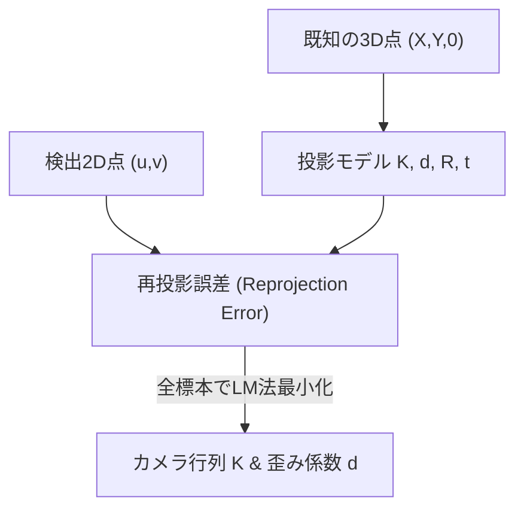
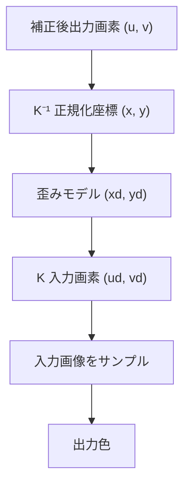

# 実践カメラキャリブレーション & レンズ歪み補正 スライド構成

ChArUco Board と OpenGL/GLSL によるリアルタイム高精度画像補正技術

---

## 1. アジェンダ

### 前半: 理論と基礎
- カメラモデリングの基礎（ピンホールモデル・透視投影・内部/外部パラメータ）
- レンズ歪みの数理（放射歪み・接線歪み）
- ChArUco Board 原理と特徴（チェスボード＋ArUco）
- C++ OpenCV 実装の詳細関数と引数構造 (`CharucoBoard`, `detectBoard`, `matchImagePoints`, `calibrateCamera`)
- 全体システム構成 (`calib-wom-msmf` & `mfcapture`)

### 後半: 実装とハンズオン
- CPU (OpenCV `remap`) vs GPU (GLSL) 補正パイプライン
- C++ CPU 補正の画像マップ生成実装 (`initUndistortRectifyMap`)
- `undistortion.frag` シェーダー解読
- 逆写像 (Backward Mapping) の座標変換
- Windows Media Foundation (MSMF) 低遅延キャプチャ設計
- Windows / VS2022 実習ハンズオン A / B

---

## 2. カメラモデリングの基礎原理

### ピンホールモデルと透視投影 (Perspective Projection)
3次元世界座標系 $(X_w, Y_w, Z_w)$ から2次元画像平面 $(u, v)$ への透視投影方程式：

$$s \begin{bmatrix} u \\ v \\ 1 \end{bmatrix} = K \begin{bmatrix} R & t \end{bmatrix} \begin{bmatrix} X_w \\ Y_w \\ Z_w \\ 1 \end{bmatrix}$$

- **カメラ内部行列 (Camera Matrix $K$):**
  $$K = \begin{bmatrix} f_x & 0 & c_x \\ 0 & f_y & c_y \\ 0 & 0 & 1 \end{bmatrix}$$
  $f_x, f_y$: 画素単位の焦点距離、$c_x, c_y$: 主点（光学中心）

- **カメラ外部行列 (Extrinsic Parameters $[R | t]$):**
  - **回転行列 $R$ ($3 \times 3$):** 世界座標系に対するカメラの向き（回転）を表す直交行列。
  - **並進ベクトル $t$ ($3 \times 1$):** 世界座標系原点に対するカメラの位置オフセット。
  - 姿勢変換式: $P_c = R P_w + t$

---

## 3. レンズ歪みの数理モデル

### 1. 放射歪み (Radial Distortion)
$$x_{\text{distorted}} = x(1 + k_1 r^2 + k_2 r^4 + k_3 r^6)$$
$$y_{\text{distorted}} = y(1 + k_1 r^2 + k_2 r^4 + k_3 r^6)$$

### 2. 接線歪み (Tangential Distortion)
$$\delta x = 2 p_1 x y + p_2(r^2 + 2x^2)$$
$$\delta y = p_1(r^2 + 2y^2) + 2 p_2 x y$$

本システムでは $[k_1, k_2, p_1, p_2, k_3]$ の 5 係数モデルを使用。

---

## 4. ChArUco Board によるキャリブレーション

- **チェスボード**: サブピクセル精度の交点検出。ただしパターン一部遮蔽で検出不能。
- **ArUco マーカー**: 個別 ID によるオクルージョン耐性。
- **ChArUco Board**: ArUco で交点 ID を特定し、チェスボード交点で超高精度検出。

---

## 4.1 キャリブレーションで推定するもの



- **全画像共通**: カメラ内部行列 $K$, 歪み係数 $d$
- **画像ごと（標本ごと）**: 外部パラメータ $R_i, t_i$
- **観測量**: 検出 2D 画素座標 $(u, v)$
- **既知量**: 設計 3D ボード座標 $(X, Y, 0)$

---

## 4.2 C++ 実装：ChArUco Board の定義と構成

```cpp
cv::aruco::Dictionary dictionary =
  cv::aruco::getPredefinedDictionary(cv::aruco::DICT_6X6_250);

// CharucoBoard コンストラクタ呼び出し
cv::aruco::CharucoBoard board{
  cv::Size{10, 7},   // size (横マス数, 縦マス数)
  0.030f,            // squareLength [m]
  0.022f,            // markerLength [m]
  dictionary         // ArUco 辞書
};

cv::aruco::CharucoDetector detector{board};
```


### ChArUco Board とは (OpenCV チュートリアル準拠)
チェスボードの「高精度交点検出」と ArUco の「個体識別・遮蔽耐性」を組み合わせたハイブリッドパターン。黒マス内に固有 ID マーカーが交互配置され、**ボードの一部が画面外や物体の陰に隠れていても交点座標と位置関係を正確に決定可能**。

### `cv::aruco::CharucoBoard` 引数解説
- `size` (`cv::Size`): チェスボードのマス数 (横, 縦)
- `squareLength` (`float`): マス目一辺の物理長 [m]
- `markerLength` (`float`): 内包 ArUco マーカー一辺の物理長 [m] (`markerLength < squareLength`)
- `dictionary`: マーカー識別用辞書パターン

---

## 4.3 C++ 実装：検出と標本座標マッチング

```cpp
std::vector<cv::Point2f> charucoCorners;
std::vector<int> charucoIds;

// 1. ボード交点検出
detector.detectBoard(frame, charucoCorners, charucoIds);

if (charucoCorners.size() >= 4) {
  std::vector<cv::Point3f> objectPoints;
  std::vector<cv::Point2f> imagePoints;

  // 2. 3D-2D 対応点の抽出
  board.matchImagePoints(
    charucoCorners, charucoIds,
    objectPoints, imagePoints);

  allObjectPoints.push_back(std::move(objectPoints));
  allImagePoints.push_back(std::move(imagePoints));
}
```

### 処理概略と `corners.size() >= 4` の理由
平面オブジェクトと 2D 画像との間の姿勢変換 (PnP / ホモグラフィ) を幾何学的に決定するには**最低 4 点の対応点が必要**となるためです。4点未満では自由度が不足するため処理をスキップします。

### 関数の引数解説
- `detector.detectBoard(image, corners, ids)`:
  - `image`: 入力画像 (`cv::Mat`)
  - `corners`: 検出された交点の 2D 画素座標（出力）
  - `ids`: 検出された交点 ID 配列（出力）
- `board.matchImagePoints(cCorners, cIds, objPts, imgPts)`:
  - `cCorners` / `cIds`: 検出交点座標および ID 配列（入力）
  - `objPts`: 対応する理論 3D ボード座標 $(X, Y, 0)$（出力）
  - `imgPts`: `objPts` と 1 対 1 対応する 2D 観測画素座標（出力）

---

## 4.4 C++ 実装：最適化計算 (`calibrateCamera`)

```cpp
cv::Mat K, distortion;
std::vector<cv::Mat> rvecs, tvecs;

double rms = cv::calibrateCamera(
  allObjectPoints,  // 全標本の 3D 点群
  allImagePoints,   // 全標本の 2D 画素点群
  imageSize,        // 画像サイズ
  K,                // カメラ内部行列 (出力)
  distortion,       // 歪み係数 (出力)
  rvecs, tvecs,     // 各標本の姿勢 [R|t] (出力)
  cv::noArray(), cv::noArray(), cv::noArray(),
  0                 // 較正オプションフラグ
);
```

### 「最適化計算」の意味
実測された 2D 画素座標 $p$ と、推定パラメータ $(K, d, R_i, t_i)$ で 3D 点を画像上に再投影した座標 $\hat{p}$ との差（**再投影誤差 Reprojection Error**）の自乗和を最小化する非線形最小二乗問題です。**Levenberg-Marquardt (LM) 法**による反復計算により内部行列 $K$、歪み係数 $d$、各標本姿勢 $[R_i | t_i]$ を同時一括推定します。

---

## 5. 全体システムアーキテクチャ


---

## 6. 歪み補正パイプラインの比較 (CPU vs GPU)

| 評価項目 | OpenCV 歪み補正 (CPU) | OpenGL 歪み補正 (GPU / GLSL) |
| :--- | :--- | :--- |
| **実行エンジン** | CPU (`cv::remap`) | GPU (`undistortion.frag`) |
| **パイプライン位置** | キャプチャ直後、OpenGL 転送前に実行 | OpenGL テクスチャ描画時にシェーダーで実行 |
| **CPU 負荷** | 解像度に比例して高い | **ほぼゼロ** |
| **事前準備** | `cv::initUndistortRectifyMap` でマップ構築 | Uniform へ焦点距離・主点・係数を転送 |

---

## 7. OpenCV (CPU) による C++ 歪み補正処理

```cpp
// 1. 初期化・マップ作成（解像度変更時のみ1回実行）
cv::Mat map1, map2;
cv::initUndistortRectifyMap(
    cameraMatrix, distCoeffs,
    cv::Mat(),       // 補正回転 R (単位行列)
    cameraMatrix,    // 新しいカメラ行列 New K
    imageSize,       // 画像サイズ
    CV_32FC1,        // マップの型
    map1, map2       // 出力参照座標マップ
);

// 2. 毎フレームの補正実行 (CPU)
cv::Mat srcFrame, dstFrame;
cv::remap(
    srcFrame, dstFrame,
    map1, map2,
    cv::INTER_LINEAR  // 双線形補間
);
```

---

## 8. GLSL 歪み補正シェーダー (`undistortion.frag`)

```glsl
// 理想的な正規化座標 p = (x, y) の算出
vec2 p = (v_texcoord * size - center) / focal;

// 放射歪み & 接線歪みモデル適用
float r2 = dot(p, p);
float radial = 1.0 + dist_k.x * r2 + dist_k.y * r2 * r2 + dist_k3 * r2 * r2 * r2;
vec2 tangential = vec2(
    2.0 * dist_k.z * p.x * p.y + dist_k.w * (r2 + 2.0 * p.x * p.x),
    dist_k.z * (r2 + 2.0 * p.y * p.y) + 2.0 * dist_k.w * p.x * p.y
);
vec2 pd = p * radial + tangential;

// 歪んだ位置の UV 座標でテクスチャ参照
vec2 uv = (pd * focal + center) / size;
fragment = texture(image, uv);
```

---

## 9. なぜ「逆向き」に座標を求めるのか (逆写像)



---

## 10. Windows Media Foundation (MSMF) による低遅延キャプチャ

- `CamMf` クラスによる MSMF 直接操作
- `CODECAPI_AVLowLatencyMode` で MFT 内部バッファリングを排除
- レイテンシ優先モード (`prioritizeLatency == true`)

---

## 11. まとめ

- ChArUco Board による高精度な交点認識
- 透視投影モデルと内部 $K$・外部 $[R|t]$ パラメータの最適化
- CPU 補正 (OpenCV `remap`) と GPU 補正 (GLSL シェーダー) の実装構造
- MSMF による超低遅延映像処理
