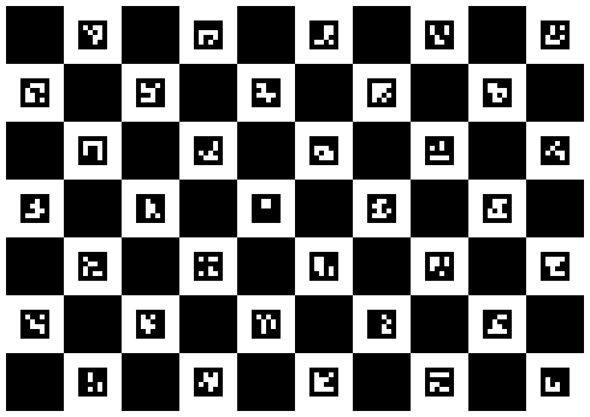
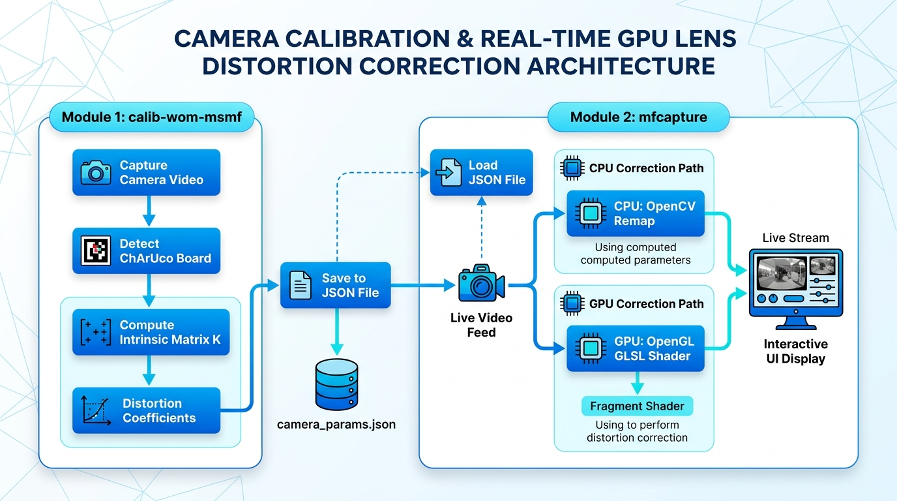

# 実践カメラキャリブレーション & レンズ歪み補正 講義・実習ハンドブック

本ドキュメントは、ChArUco Board を用いたカメラキャリブレーションプログラム `calib-wom-msmf` および、キャリブレーション結果を用いてリアルタイムにレンズ歪み補正を行って表示するプログラム `mfcapture` を用いた技術勉強会の受講者用詳細資料です。

対象読者は、C++ や Swift 等で OpenCV を用いた画像処理アプリの開発経験があるエンジニアです。

---

## 第1章 開発環境とプロジェクト規約

### 1.1 開発環境要件

本勉強会で使用する開発環境およびツール群は以下の通りです。

- **OS**: Windows 11 / 10 (64bit / x64)
- **IDE**: Visual Studio 2022 以降
- **言語仕様**: C++17 (`/std:c++17`)
- **シェル環境**: PowerShell
- **事前インストールツール**: `git`, `cmake` (3.13以降), `python` (PATHが通っていること)

### 1.2 ソースコード文字コード規約

| ファイル種別 | 拡張子 | 文字コード | BOMの有無 | 理由 |
| :--- | :--- | :--- | :--- | :--- |
| **C++ ソース/ヘッダ** | `.h`, `.cpp` | `UTF-8` | **BOM あり** | MSVC (`cl.exe`) で日本語コメントが含まれる場合のコンパイル文字化け・エラーを防止するため |
| **GLSL シェーダー** | `.vert`, `.frag`, `.comp` | `UTF-8` | **BOM なし** | OpenGL の GLSL コンパイラ (`glCompileShader`) が BOM プレフィックスを構文エラーとみなすため |

---

## 第2章 カメラモデリングとレンズ歪みの数理

### 2.1 ピンホールカメラモデル・内部パラメータ・外部パラメータ

ピンホールカメラモデルでは、3次元空間の点 $P_w = (X_w, Y_w, Z_w)^T$ がカメラの光学中心を通り、画像平面上の点 $p = (u, v)^T$ に投影されます。

**透視投影 (Perspective Projection)** 方程式は斉次座標系を用いて以下のように記述されます。

$$
s \begin{bmatrix} u \\ v \\ 1 \end{bmatrix} = K \begin{bmatrix} R & t \end{bmatrix} \begin{bmatrix} X_w \\ Y_w \\ Z_w \\ 1 \end{bmatrix}
$$

#### 1. カメラ内部行列 (Camera Matrix $K$)
$$
K = \begin{bmatrix} f_x & 0 & c_x \\ 0 & f_y & c_y \\ 0 & 0 & 1 \end{bmatrix}
$$
- $f_x, f_y$: 画素単位で表した焦点距離 (Focal Length)。
- $c_x, c_y$: 光軸と画像平面の交点である主点 (Principal Point) の画素座標。

#### 2. カメラ外部行列 (Extrinsic Parameters $[R | t]$)
世界座標系からカメラ座標系への剛体変換 $P_c = R P_w + t$ を表します。
- **回転行列 $R$ ($3 \times 3$):** 世界座標系に対するカメラの向き（回転）を表す直交行列。
- **並進ベクトル $t$ ($3 \times 1$):** 世界座標系原点に対するカメラの位置オフセット。

---

## 第3章 ChArUco Board によるキャリブレーション原理

### 3.1 ChArUco Board とは (OpenCV チュートリアル準拠)

ChArUco Board はチェスボードと ArUco マーカーを融合させたハイブリッドパターンです。



チェスボードのサブピクセル交点検出精度と、ArUco マーカーによる個別交点識別能力を両立。黒マス内に固有 ID の ArUco マーカーが交互配置されており、マーカーの ID 識別によって「各交点がボード上のどの位置か」が一意特定できるため、**ボードの一部が画面外や物体の陰に隠れていても高精度に較正が可能**です。

---

### 3.4 C++ 実装手順1：辞書、ボード、検出器を作る

```cpp
cv::aruco::Dictionary dictionary =
  cv::aruco::getPredefinedDictionary(cv::aruco::DICT_6X6_250);

constexpr int squaresX = 10;
constexpr int squaresY = 7;
constexpr float squareLength = 0.030f;  // 30 mm
constexpr float markerLength = 0.022f;  // 22 mm

// CharucoBoard コンストラクタ
cv::aruco::CharucoBoard board{
  cv::Size{squaresX, squaresY}, squareLength, markerLength, dictionary
};

cv::aruco::CharucoDetector boardDetector{board};
```

---

### 3.7 C++ 実装手順4：標本データを抽出・保存する

```cpp
std::vector<cv::Point3f> objectPoints;
std::vector<cv::Point2f> imagePoints;

// 最低 4 点が必要なため判定
if (charucoCorners.size() < 4) return false;

board.matchImagePoints(charucoCorners, charucoIds, objectPoints, imagePoints);
```

**`charucoCorners.size() >= 4` を判定している理由:**
平面 3D オブジェクトと 2D 画像間の姿勢変換（透視投影・PnP 問題 / ホモグラフィ）を決定するには**最低 4 点の対応点が必要**であるためです。4点未満では自由度が不足するため処理を中断・スキップします。

---

### 3.8 C++ 実装手順5：内部パラメータを推定する (`calibrateCamera`)

```cpp
cv::Mat cameraMatrix, distCoeffs;
std::vector<cv::Mat> rvecs, tvecs;

double rms = cv::calibrateCamera(
  allObjectPoints, allImagePoints, imageSize,
  cameraMatrix, distCoeffs, rvecs, tvecs,
  cv::noArray(), cv::noArray(), cv::noArray(), 0
);
```

**最適化計算の意味:**
実測された 2D 画素座標 $p_{ij}$ と、推定パラメータ $(K, d, R_i, t_i)$ で 3D ボード点を画像上へ再投影した計算座標 $\hat{p}_{ij}$ との差（**再投影誤差 Reprojection Error**）の自乗和を最小化する非線形最小二乗問題です。**Levenberg-Marquardt (LM) 法**による反復計算によって、全標本のデータから内部行列 $K$、歪み係数 $d$、各標本のカメラ姿勢 $[R_i | t_i]$ を一括して同時に最適推定します。

---

## 第4章 プログラム設計とアーキテクチャ


