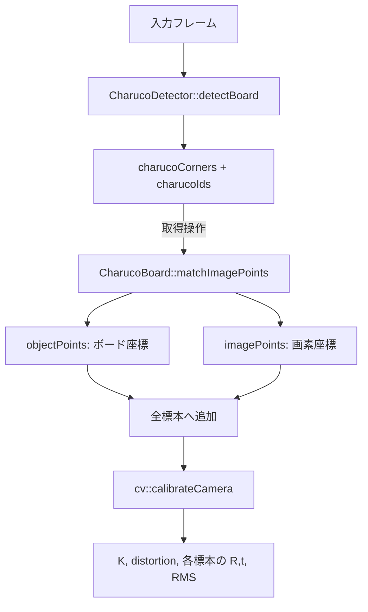
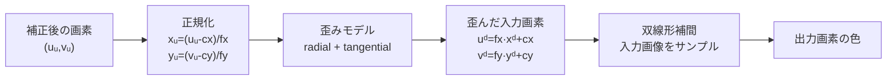

# 実践カメラキャリブレーション & レンズ歪み補正 講義・実習ハンドブック

本ドキュメントは、ChArUco Board を用いたカメラキャリブレーションプログラム `calib-wom-msmf` および、キャリブレーション結果を用いてリアルタイムにレンズ歪み補正を行って表示するプログラム `mfcapture` を用いた技術勉強会の受講者用詳細資料です。

対象読者は、C++ や Swift 等で OpenCV を用いた画像処理アプリの開発経験があるエンジニアです。

---

## 第1章 開発環境とプロジェクト規約

### 1.1 開発環境要件

本勉強会で使用する開発環境およびツール群は以下の通りです。

- **OS**: Windows 11 / 10 (64bit / x64)
- **IDE**: Visual Studio 2022 以降
- **言語仕様**: C++17 (`/std:c++17`)
- **シェル環境**: PowerShell
- **事前インストールツール**: `git`, `cmake` (3.13以降), `python` (PATHが通っていること)

### 1.2 ソースコード文字コード規約

Visual Studio および MSVC コンパイラと GLSL シェーダーコンパイラの動作の違いに配慮し、プロジェクト全体で以下の文字コード規約を遵守します。

| ファイル種別 | 拡張子 | 文字コード | BOMの有無 | 理由 |
| :--- | :--- | :--- | :--- | :--- |
| **C++ ソース/ヘッダ** | `.h`, `.cpp` | `UTF-8` | **BOM あり** | MSVC (`cl.exe`) で日本語コメントが含まれる場合のコンパイル文字化け・エラーを防止するため |
| **GLSL シェーダー** | `.vert`, `.frag`, `.comp` | `UTF-8` | **BOM なし** | OpenGL の GLSL コンパイラ (`glCompileShader`) が BOM プレフィックスを構文エラーとみなすため |

### 1.3 外部ライブラリおよびバージョン

ビルド時に `CMakeLists.txt` により自動的にプロジェクト直下の `libs` ディレクトリ以下に取得・配置されます。

- **OpenCV 4.13.0**: 動画入力、画像処理、ChArUco Board キャリブレーション機能に使用
- **GLFW 3.4**: ウィンドウ作成、OpenGL コンテキスト管理、入力イベント制御
- **Dear ImGui v1.92.8**: GUI フロントエンド (GLFW + OpenGL3 バックエンド実装を直接リンク)
- **Native File Dialog Extended (nfd)**: OS 標準のファイル選択ダイアログ

### 1.4 CMake による Visual Studio ソリューション構成

`CMakeLists.txt` を用いて Visual Studio 2022 用のソリューションファイルを生成した際、ソリューションエクスプローラ上で以下のようにファイルが整理されます。

- **`Header Files` フィルタ**: C++ ヘッダファイル (`.h`)
- **`Shader Files` フィルタ**: GLSL シェーダーソース (`.vert`, `.frag`, `.comp`)
- **`Source Files` フィルタ**: C++ 実装ファイル (`.cpp`)

---

## 第2章 カメラモデリングとレンズ歪みの数理

### 2.1 ピンホールカメラモデルとカメラ行列

ピンホールカメラモデルでは、3次元空間の点 $P = (X_w, Y_w, Z_w)^T$ がカメラの光学中心を通り、画像平面上の点 $p = (u, v)^T$ に投影されます。

透視投影方程式は斉次座標系を用いて以下のように記述されます。

$$
s \begin{bmatrix} u \\ v \\ 1 \end{bmatrix} = K \begin{bmatrix} R & t \end{bmatrix} \begin{bmatrix} X_w \\ Y_w \\ Z_w \\ 1 \end{bmatrix}
$$

ここで、$K$ はカメラ内部パラメータ行列 (Camera Matrix) であり、次のように定義されます。

$$
K = \begin{bmatrix} f_x & 0 & c_x \\ 0 & f_y & c_y \\ 0 & 0 & 1 \end{bmatrix}
$$

- $f_x, f_y$: 画素単位で表した焦点距離 (Focal Length)。物理的な焦点距離 $f$ [mm] とピクセルサイズ $s_x, s_y$ [mm/pixel] から $f_x = f / s_x$, $f_y = f / s_y$ と算定される。
- $c_x, c_y$: 光軸と画像平面の交点である主点 (Principal Point) の画素座標。

---

### 2.2 レンズ歪みの数理モデル

実際のカメラレンズでは、光線の屈折やレンズ枚数・形状に起因する歪み (Lens Distortion) が生じます。主に **放射歪み (Radial Distortion)** と **接線歪み (Tangential Distortion)** の2種類を考慮します。

#### 1. 正規化画像座標への変換
3次元カメラ座標系 $(X_c, Y_c, Z_c)$ の点を焦点距離 1 の画像平面に投影します。

$$
x = \frac{X_c}{Z_c}, \quad y = \frac{Y_c}{Z_c}
$$

光学中心からの距離を $r = \sqrt{x^2 + y^2}$ とします。

#### 2. 放射歪み (Radial Distortion)
レンズの縁に向かって光線が過剰または不足して屈折することで生じる歪み（樽型歪みまたは糸巻き型歪み）です。

$$
x_{\text{radial}} = x (1 + k_1 r^2 + k_2 r^4 + k_3 r^6)
$$
$$
y_{\text{radial}} = y (1 + k_1 r^2 + k_2 r^4 + k_3 r^6)
$$

$k_1, k_2, k_3$ は放射歪み係数です。

#### 3. 接線歪み (Tangential Distortion)
レンズ素子とイメージセンサー（CCD/CMOS）が完全に平行についていない場合に発生する歪みです。

$$
\delta x = 2 p_1 x y + p_2 (r^2 + 2 x^2)
$$
$$
\delta y = p_1 (r^2 + 2 y^2) + 2 p_2 x y
$$

$p_1, p_2$ は接線歪み係数です。

#### 4. 歪み適用後の座標変換
歪みが付加された正規化座標 $(x', y')$ は以下のようになります。

$$
x' = x_{\text{radial}} + \delta x
$$
$$
y' = y_{\text{radial}} + \delta y
$$

最終的な画素座標 $(u, v)$ はカメラ行列 $K$ を掛けて得られます。

$$
u = f_x x' + c_x
$$
$$
v = f_y y' + c_y
$$

本プロジェクトでは、歪みパラメータとして $[k_1, k_2, p_1, p_2, k_3]$ の 5 つの係数を扱います。

---

## 第3章 ChArUco Board によるキャリブレーション原理

### 3.1 チェスボード / ArUco マーカー / ChArUco Board の比較

カメラキャリブレーションでは、3D空間上の既知のパターン座標と2D画像上の検出座標との対応関係から、Reprojection Error (再投影誤差) を最小化するように内部パラメータ $K$ と歪み係数を最適化します。

```
チェスボード               ArUco マーカー             ChArUco Board
+---+---+---+---+          +---+---+---+---+          +---+---+---+---+
|   |   |   |   |          |M1 |   |M2 |   |          |M1 |   |M2 |   |
+---+---+---+---+          +---+---+---+---+          +---+---+---+---+
|   |   |   |   |          |   |M3 |   |M4 |          |   |M3 |   |M4 |
+---+---+---+---+          +---+---+---+---+          +---+---+---+---+
```

- **チェスボード (Chessboard)**:
  - 白黒の交点に対して勾配を用いたサブピクセル精度 (Sub-pixel accuracy) のコーナー検出が可能。
  - パターン全体が画面内に収まっていないと個別交点のインデックスを特定できない（部分遮蔽に弱い）。
- **ArUco マーカー (ArUco Markers)**:
  - 各マーカーに固有のバイナリIDが埋め込まれており、パターンの一部が隠れていても個々のマーカーを特定可能。
  - コーナー位置の検出精度がチェスボード交点に比べて若干劣る。
- **ChArUco Board (ArUco + Chessboard)**:
  - チェスボードのマス目内に ArUco マーカーを配置したハイブリッド構成。
  - ArUco マーカーによりチェスボード交点のインデックスを一意に特定できるため、**ボードの一部がカメラ枠外に移動したり遮蔽されていても、見えている交点だけで正確なキャリブレーションが可能**。
  - サブピクセル精度の交点位置が得られるため、極めて高い精度を実現。

---

### 3.2 再投影誤差 (Reprojection Error) と最適化

キャリブレーションでは、推定した $K$ と歪み係数を用いて3D点を画像上に再投影した点 $\hat{p}_{ij}$ と、実際に画像上で検出された点 $p_{ij}$ とのユークリッド距離の自乗和を最小化する非線形最小二乗問題（Levenberg-Marquardt 法）を解きます。

$$
E = \sum_{i} \sum_{j} \| p_{ij} - \hat{p}_{ij}(K, d, R_i, t_i) \|^2
$$

RMS 再投影誤差は小さいほど観測点とモデルが一致しています。ただし、解像度、
レンズ、印刷精度、検出条件で妥当な値は変わります。**0.5 ピクセル以下は一つの目安**
であって合否の絶対条件ではありません。平均値だけでなく、標本ごとの誤差、推定値の
妥当性、補正画像の直線性も確認します。

---

### 3.3 キャリブレーション処理の入力と出力

実装では、次のデータを区別して保持します。

| データ | 型の例 | 寿命 |
| :--- | :--- | :--- |
| 現フレームの ChArUco コーナー | `vector<Point2f>` | 次の検出まで |
| 現フレームのコーナー ID | `vector<int>` | 次の検出まで |
| ボード上の既知座標 | `vector<Point3f>` | 標本として保存 |
| 画像上の観測座標 | `vector<Point2f>` | 標本として保存 |
| 全標本 | `vector<vector<...>>` | 較正を実行するまで |
| カメラ行列・歪み係数 | `cv::Mat` | 較正結果として保存 |



検出するたびに自動で標本を追加せず、表示を確認してから「取得」操作で保存します。
同じ姿勢の連続フレームが大量に入ることと、ブレたフレームが混入することを防ぐためです。

### 3.4 C++ 実装手順1：辞書、ボード、検出器を作る

```cpp
#include <opencv2/aruco.hpp>
#include <opencv2/aruco/charuco.hpp>

cv::aruco::Dictionary dictionary =
  cv::aruco::getPredefinedDictionary(cv::aruco::DICT_6X6_250);

constexpr int squaresX = 10;
constexpr int squaresY = 7;
constexpr float squareLength = 0.030f;  // 30 mmをmで表す
constexpr float markerLength = 0.022f;  // 22 mmをmで表す

cv::aruco::CharucoBoard board{
  cv::Size{squaresX, squaresY},
  squareLength,
  markerLength,
  dictionary
};

cv::aruco::CharucoDetector boardDetector{board};
```

`squareLength` はチェスボード1マスの一辺、`markerLength` は黒いマーカー部分の
一辺です。両者を逆にせず、`markerLength < squareLength` とします。単位は任意ですが、
同一プログラム内で統一します。メートルなら、後で `solvePnP()` が返す並進ベクトルも
メートルになります。

実際の `calib-wom-msmf` では `Calibration::createBoard()` がこの生成を担当し、
UI で寸法または辞書を変更した場合にボードと検出器を作り直します。

### 3.5 C++ 実装手順2：印刷用画像を生成する

```cpp
cv::Mat boardImage;
board.generateImage(
  cv::Size{1400, 980}, // 出力画素数。物理寸法ではない
  boardImage,
  20,                  // 外周余白
  1                    // マーカー境界のビット数
);

if (!cv::imwrite("ChArUcoBoard.png", boardImage)) {
  throw std::runtime_error("ボード画像を保存できません");
}
```

印刷ダイアログでは「用紙に合わせる」を無効にし、意図した倍率で印刷します。印刷後に
複数のマスをノギスまたは定規で測り、平均した一辺を設定値へ反映します。紙が波打つと
平面というモデルが崩れるため、硬い平板へ貼り付けます。家庭用プリンターでは縦横の
倍率がわずかに異なる場合もあるため、縦横を別々に確認します。

### 3.6 C++ 実装手順3：毎フレーム検出する

```cpp
std::vector<cv::Point2f> charucoCorners;
std::vector<int> charucoIds;

void detectCharuco(const cv::Mat& input)
{
  cv::Mat bgr;
  if (input.channels() == 4)
    cv::cvtColor(input, bgr, cv::COLOR_BGRA2BGR);
  else
    bgr = input;

  boardDetector.detectBoard(bgr, charucoCorners, charucoIds);

  if (!charucoCorners.empty()) {
    cv::aruco::drawDetectedCornersCharuco(
      bgr, charucoCorners, charucoIds, cv::Scalar{0, 0, 255});
  }
}
```

検出用画像と表示用画像を共有すると、描画した赤い点が後段処理へ混ざります。
どの段階でオーバーレイを描くかを明確にしてください。また、較正時の `imageSize` は
検出に使用した画像のサイズであり、ウィンドウサイズではありません。

最低4点でも幾何学的な対応は作れますが、較正標本としては、できるだけ多くの
ChArUco コーナーが明瞭に見えるフレームを選びます。

### 3.7 C++ 実装手順4：利用者の操作で標本を保存する

```cpp
std::vector<std::vector<cv::Point3f>> allObjectPoints;
std::vector<std::vector<cv::Point2f>> allImagePoints;

bool recordSample()
{
  if (charucoCorners.size() < 4) return false;

  std::vector<cv::Point3f> objectPoints;
  std::vector<cv::Point2f> imagePoints;
  board.matchImagePoints(
    charucoCorners, charucoIds, objectPoints, imagePoints);

  if (objectPoints.size() != imagePoints.size()
    || objectPoints.size() < 4)
    return false;

  allObjectPoints.push_back(std::move(objectPoints));
  allImagePoints.push_back(std::move(imagePoints));
  return true;
}
```

`matchImagePoints()` は ID を使い、検出した2D点と対応するボード上の3D点
$(X,Y,0)$ を同じ順序で返します。この対応順序を崩してはいけません。

良い標本集合には次の変化を含めます。

- ボードが画像中央だけでなく、左上・右上・左下・右下にある
- 近距離と遠距離がある
- 水平軸・垂直軸の両方向へ傾いている
- 主点付近だけでなく、歪みが強い画像周辺にもコーナーがある
- モーションブラー、白飛び、反射、極端な浅い角度がない

### 3.8 C++ 実装手順5：内部パラメータを推定する

```cpp
cv::Mat cameraMatrix;
cv::Mat distCoeffs;
std::vector<cv::Mat> rvecs;
std::vector<cv::Mat> tvecs;

if (allObjectPoints.size() < 6)
  throw std::runtime_error("標本が不足しています");

const int flags = 0; // 5係数モデルを自由に推定
const double rms = cv::calibrateCamera(
  allObjectPoints,
  allImagePoints,
  imageSize,
  cameraMatrix,
  distCoeffs,
  rvecs,
  tvecs,
  cv::noArray(),
  cv::noArray(),
  cv::noArray(),
  flags
);

if (cameraMatrix.rows != 3 || cameraMatrix.cols != 3
  || distCoeffs.total() < 5
  || !cv::checkRange(cameraMatrix)
  || !cv::checkRange(distCoeffs))
  throw std::runtime_error("較正結果が不正です");
```

OpenCV 4 系では、ChArUco の ID 付きコーナーから
`CharucoBoard::matchImagePoints()` で通常の object/image point 配列を作り、
`cv::calibrateCamera()` に渡せます。このプロジェクトもこの経路を使用しています。

フラグはモデルに対する仮定です。例えば `CALIB_ZERO_TANGENT_DIST` を付けると
$p_1,p_2$ を0へ固定します。根拠なく自由度を増減させるのではなく、レンズ特性、
標本数、残差を見て選びます。`mfcapture` は5係数を読むため、合理モデルなどを
有効にして8係数以上を出力する場合は、読み込み側も同時に設計変更する必要があります。

### 3.9 C++ 実装手順6：標本ごとの誤差を調べる

```cpp
std::vector<double> perViewError(allObjectPoints.size());

for (size_t i = 0; i < allObjectPoints.size(); ++i) {
  std::vector<cv::Point2f> projected;
  cv::projectPoints(
    allObjectPoints[i], rvecs[i], tvecs[i],
    cameraMatrix, distCoeffs, projected);

  const double l2 = cv::norm(
    allImagePoints[i], projected, cv::NORM_L2);
  perViewError[i] =
    std::sqrt((l2 * l2) / projected.size());
}
```

全体 RMS が小さくても、一枚だけ大きな誤差を持つことがあります。その画像を確認し、
ブレ、誤検出、紙の反りが原因なら除外して再計算します。ただし、数値を小さくするため
だけに都合の悪い姿勢を全て削除すると、実利用範囲で不安定なモデルになります。

### 3.10 パラメータの保存

`mfcapture` が読む最小構造は次のとおりです。

```json
{
  "camera matrix": [
    [1000.0, 0.0, 960.0],
    [0.0, 1000.0, 540.0],
    [0.0, 0.0, 1.0]
  ],
  "distortion": [
    [-0.25],
    [0.08],
    [0.001],
    [-0.0005],
    [-0.01]
  ],
  "error": 0.31
}
```

`camera matrix` は3×3、`distortion` は5×1として保存します。較正時と異なる解像度で
使う場合、歪み係数はそのままですが、$f_x,f_y,c_x,c_y$ は解像度比でスケールします。
アスペクト比が変わる切り出しやリサイズでは、単純な一様倍率では済みません。

---

## 第4章 プログラム設計とアーキテクチャ

### 4.1 全体システムアーキテクチャ図

本システムの全体アーキテクチャ図です。入力ソースからの画像キャプチャ、`calib-wom-msmf` によるパラメータ推測と JSON 出力、および `mfcapture` による CPU (OpenCV) / GPU (GLSL) 補正パイプラインの流れを示しています。

```
+-------------------------------------------------------------------+
|                        calib-wom-msmf                             |
|  - MSMF / OpenCV による映像取得                                  |
|  - ChArUco マーカー検出 & パラメータ推定                          |
|  - calib_config.json 読込 / 較正データ (JSON) 出力                 |
+-------------------------------------------------------------------+
                                  |
                        較正データ JSON 出力
                                  v
+-------------------------------------------------------------------+
|                           mfcapture                               |
|  - 較正データ JSON 読み込み                                       |
|  - OpenCV CPU 補正 (cv::remap)                                    |
|  - OpenGL GPU 補正 (undistortion.frag)                            |
|  - Dear ImGui による GUI 制御 & リアルタイム比較描画               |
+-------------------------------------------------------------------+
```

---

### 4.2 Windows Media Foundation (`CamMf`) による低遅延設計

Windows において Web カメラ映像を取得する際、一般的な `cv::VideoCapture` では内部フレームバッファにより数フレーム分のレイテンシが発生することがあります。

`CamMf` では Microsoft Media Foundation (MSMF) を直接操作し、以下の設計により超低遅延化を達成しています。

1. **`CODECAPI_AVLowLatencyMode` の適用**:
   MFT (Media Foundation Transform) デコーダに対し、低遅延モードを設定して内部バッファリングを無効化。
2. **フレーム処理モードの動的切り替え**:
   - `prioritizeLatency == true`: メインスレッドがフレームを描画中の間に新しいフレームが届いた場合、古いフレームを上書き破棄して常に最新フレームを提供する（レイテンシ最優先）。
   - `prioritizeLatency == false`: スレッド間同期バッファを用いてフレームを取りこぼさずにシーケンシャル処理する。
3. **Lazy Initialization (遅延初期化)**:
   フォーマット一覧の列挙時にはデコーダ生成等の重い処理を行わず、ユーザーが「開始」を指示したタイミングでフォーマットを確定・適用。
4. **RAII による COM リソース管理**:
   `IMFMediaSource`, `IMFSourceReader` 等の COM オブジェクトは RAII ラッパー構造体で管理し、早期 return や例外発生時にも確実に `Release()` される設計。

---

### 4.3 `mfcapture` における 2 種類の歪み補正パイプライン

`mfcapture` では、同一の内部パラメータ JSON を用いて、CPU 補正と GPU 補正の性能および処理構造の違いを比較できます。

```
-----------------------------------------------------------------------------------
【方式 A】 OpenCV CPU 歪み補正
[カメラ入力] -> (CPU: cv::remap) -> [OpenGL PBO/テクスチャ転送] -> (通常Shader) -> [画面]
-----------------------------------------------------------------------------------
【方式 B】 OpenGL GPU 歪み補正
[カメラ入力] ---------------------> [OpenGL PBO/テクスチャ転送] -> (補正Shader) -> [画面]
                                                                  └ undistortion.frag
-----------------------------------------------------------------------------------
```

#### 方式 A: OpenCV CPU 補正 (`cv::remap`)
- `Undistortion::apply()` が、入力画像サイズ変更時に1度だけ `cv::initUndistortRectifyMap()` で X/Y の参照座標マップ (`cv::Mat map1, map2`) を構築。
- 毎フレーム `cv::remap(src, dst, map1, map2, cv::INTER_LINEAR)` を CPU 上で実行。
- 補正結果の `cv::Mat` を OpenGL テクスチャへ転送。

#### 方式 B: OpenGL GPU 補正 (`undistortion.frag`)
- CPU 上での画像ピクセル演算は一切行わず、生の撮影フレームをそのまま OpenGL テクスチャへ転送。
- フラグメントシェーダー内において、描画対象ピクセルのスクリーン座標から逆算して歪み前のテクスチャ参照 UV 座標を動的に計算。

---

### 4.4 補正は「出力から入力を引く」逆写像

補正画像を作るとき、出力側の各画素について入力画像のどこを読むか計算します。



一見すると、歪みを「取り除く」のに歪み式を適用するのは逆に見えます。しかし、
ここで出発点にしているのは補正後画像の理想座標です。その理想点が撮影画像では
どこへ歪んで写ったかを求め、そこから色を取ります。

入力画素を補正先へ順方向に移動すると、丸め誤差によって未描画の穴と複数画素の衝突が
発生します。逆写像では出力画素ごとに参照元が決まり、OpenCV の `remap()` と GLSL の
`texture()` が自然に利用できます。

### 4.5 座標変換を数値例で追う

1920×1080、$f_x=f_y=1000$、$(c_x,c_y)=(960,540)$ とします。
補正後画素 $(1460,790)$ は、

1. 正規化座標: $x=0.5,\ y=0.25$
2. $r^2=0.5^2+0.25^2=0.3125$
3. 例として $k_1=-0.2$、他を0とすると
   $\mathrm{radial}=1-0.2\times0.3125=0.9375$
4. 歪み座標: $x_d=0.46875,\ y_d=0.234375$
5. 入力画素: $u_d=1428.75,\ v_d=774.375$

したがって出力画素 $(1460,790)$ の色には、入力画像の約
$(1428.75,774.38)$ を双線形補間した値を使います。整数にならないため補間が必要です。

### 4.6 解像度変更時の内部パラメータ

1920×1080 で較正した画像を、単純に 960×540 へ半分に縮小するなら、

$$
f'_x=0.5f_x,\quad f'_y=0.5f_y,\quad
c'_x=0.5c_x,\quad c'_y=0.5c_y
$$

とします。歪み係数は正規化座標へ作用するため変更しません。ただし、画像をクロップ
した場合は主点から切り出し左上座標を引きます。縦横比を変形した場合やカメラ側の
別読み出しモードでは、同じ光学系でも単純換算できない場合があるため再較正が安全です。

---

## 第5章 実習1: `calib-wom-msmf` でのキャリブレーション

### 5.1 ソリューションの生成とビルド

PowerShell を起動し、以下のコマンドでプロジェクトをビルドします。

```powershell
# プロジェクトディレクトリへ移動
cd d:\Users\tokoi\Documents\Projects\worktrees\calib-wom-msmf

# CMake による Visual Studio 2022 ソリューションの生成
cmake -S . -B build

# Release ビルドの実行
cmake --build build --config Release
```

ビルドが完了すると、`build/Release/calib.exe` および必要な DLL（OpenCV, GLFW 等）、シェーダーファイル、既定構成 `calib_config.json` が配置されます。

---

### 5.2 操作手順とキャリブレーションの実行

1. **`build/Release/calib.exe` を起動**します。
2. **「入力」パネル**:
   - カメラ装置を選択します。
   - 解像度・フレームレート（例: 1920x1080 30fps MJPG）を選択します。
   - 「開始」ボタンを押下してキャプチャを開始します。
3. **「較正」パネル**:
   - 使用する ChArUco Board の仕様（Squares X/Y, Square Length, Marker Length, ArUco Dictionary）を設定します。
   - 「ChArUco Board 検出」にチェックを入れます。画面上に緑色の交点と ID が重畳表示されることを確認します。
   - ボードをカメラに対して前後・左右・傾きなど様々な角度に向けながら、「標本追加」を押して標本フレームを収集します（**8〜15枚程度**の異なる角度・位置の標本を収集するのが推奨されます）。
4. **「較正実行」**:
   - 標本数が 6 以上になると「較正実行」ボタンが有効化されます。
   - ボタンを押すとキャリブレーション計算が実行され、**Reprojection Error (RMS)** が表示されます。
   - 「較正結果を保存」を押して、パラメータを JSON ファイル（例: `cal_20260727.json`）として出力します。

---

## 第6章 実習2: `mfcapture` でのリアルタイム歪み補正

### 6.1 ビルドと準備

```powershell
# mfcapture ディレクトリへ移動
cd d:\Users\tokoi\Documents\Projects\worktrees\mfcapture

# ソリューションの生成とビルド
cmake -S . -B build
cmake --build build --config Release
```

---

### 6.2 歪み補正の実行と動作比較

1. **`build/Release/mfcapture.exe` を起動**します。
2. **「ファイル」メニュー -> 「較正ファイルを開く」**を選択し、実習1で出力した JSON ファイルを読み込みます。
3. **カメラのキャプチャを開始**します。
4. **「歪み補正」パネル**でモードを切り替えます:
   - **なし (None)**: 補正なしの生映像。直線の壁や格子が曲がって見えることを確認。
   - **OpenCV (CPU)**: CPU で歪み補正を実行。直線が正しくまっすぐに補正されるが、CPU 使用率が上昇。
   - **OpenGL (GPU)**: GLSL シェーダーでリアルタイム補正。CPU 負荷なく滑らかに補正される。

---

### 6.3 GLSL シェーダーコード解説

`mfcapture` の GPU 歪み補正を担う `undistortion.frag` の核心部分のコード解説です。

```glsl
#version 150 core

in vec2 v_texcoord;         // テクスチャ座標 (0.0 ～ 1.0)
out vec4 fragment;          // 出力カラー

uniform sampler2D image;    // 入力テクスチャ
uniform vec2 focal;         // 焦点距離 (fx, fy)
uniform vec2 center;        // 主点 (cx, cy)
uniform vec4 dist_k;        // 歪み係数 (k1, k2, p1, p2)
uniform float dist_k3;      // 歪み係数 k3
uniform vec2 size;          // 入力画像サイズ (Width, Height)

void main()
{
    // 1. テクスチャ座標から画素座標 (u, v) へ変換
    vec2 pixel = v_texcoord * size;

    // 2. 正規化カメラ座標 (x, y) の算出
    vec2 p = (pixel - center) / focal;

    // 3. 歪みモデルの計算
    float r2 = dot(p, p);
    float r4 = r2 * r2;
    float r6 = r4 * r2;

    // 放射歪み成分
    float radial = 1.0 + dist_k.x * r2 + dist_k.y * r4 + dist_k3 * r6;

    // 接線歪み成分
    vec2 tangential;
    tangential.x = 2.0 * dist_k.z * p.x * p.y + dist_k.w * (r2 + 2.0 * p.x * p.x);
    tangential.y = dist_k.z * (r2 + 2.0 * p.y * p.y) + 2.0 * dist_k.w * p.x * p.y;

    // 歪み付加後の正規化座標
    vec2 pd = p * radial + tangential;

    // 4. 画素座標およびテクスチャ座標 (UV) へ再変換
    vec2 distorted_pixel = pd * focal + center;
    vec2 uv = distorted_pixel / size;

    // 5. テクスチャ範囲外判定とサンプリング
    if (uv.x < 0.0 || uv.x > 1.0 || uv.y < 0.0 || uv.y > 1.0) {
        fragment = vec4(0.0, 0.0, 0.0, 1.0); // 範囲外は黒
    } else {
        fragment = texture(image, uv);
    }
}
```

#### アルゴリズムのポイント
1. 画面上のピクセル位置から、カメラ内部パラメータ $f_x, f_y, c_x, c_y$ を用いて「歪みのない理想的な正規化座標 $p = (x, y)$」を求めます。
2. 歪み方程式を順方向に適用し、「その理想的なピクセルに対応する撮影画像の歪んだ位置 $uv$」を算出します。
3. 計算された歪み位置 $uv$ からテクスチャを逆引きサンプリングすることで、歪みのないクリアな画像を直接生成できます。

---

## 第7章 まとめ・トラブルシューティング

### 7.1 トラブルシューティング

| 症状 | 原因と対策 |
| :--- | :--- |
| **コンパイル時に文字化けや構文エラーが発生する (`cl.exe`)** | C++ ファイルの文字コードが `UTF-8 (BOMなし)` になっている可能性があります。Visual Studio で `UTF-8 with BOM` で保存し直してください。 |
| **GLSL コンパイルエラー `unsupported character \xEF`** | シェーダーファイル (`.vert`, `.frag`) に BOM が付与されています。BOM なしの `UTF-8` で保存し直してください。 |
| **キャリブレーション結果の画像が大きく歪んで崩れる** | 標本収集時にボードの向きが不十分（正面ばかり）であるか、ChArUco ボードの寸法設定 (Square Length / Marker Length) の比率が正しくありません。実測値を正しく設定し直してください。 |
| **OpenCV / GLFW の DLL が見つからないエラー** | `CMakeLists.txt` のカスタムコマンドにより `build/Release` へ DLL がコピーされているか確認してください。CMake を再実行してください。 |

### 7.2 今後の応用と展望

本実習で習得した手法は以下のような実践的アプリケーションに応用可能です。

- **魚眼・超広角カメラのリアルタイム歪み補正**（車載カメラ、防犯カメラ、全方位カメラ）
- **AR (拡張現実) / MR システムでのカメラ位置姿勢推定 (Pose Estimation)**
- **ステレオカメラによる 3D 距離計測・点群復元**
